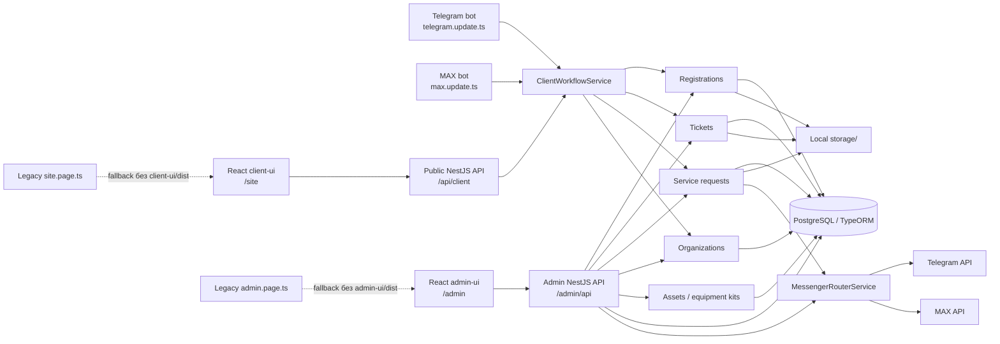

# Технический и продуктовый аудит VITMA MARKET

## 2026-07-27 update

E0-08 FileStorage foundation, E0-10 minimal Audit Log and E0-12 offline backup/verify/restore are implemented. Legacy path columns remain as compatibility fallback. See `docs/files`, `docs/audit` and `docs/backup`.

Дата аудита: 2026-07-26
Ветка: `codex/max-migration`
Коммит: `1213418` (`Migrate admin panel to React`)

## Обновление после двух ограниченных пачек этапа 0

Статус на 2026-07-26:

- E0-01 завершена: фактическая схема зафиксирована в `docs/database/SCHEMA_BASELINE_REPORT.md`.
- E0-02 завершена для объявленной тестовой базы: создан hand-reviewed clean baseline `InitialSchema1785067383157`, DataSource и migration-команды. Старая `db` не изменялась.
- E0-03 завершена: `synchronize: false`, migrations не запускаются неявно, обязательные `DB_*` валидируются без fallback.
- Базовая часть E0-11 завершена: отдельная `*_test` БД и characterization tests критичных существующих сценариев.
- E0-04 завершена: удалены fallback `admin/admin`, static/query token и автоматическое создание сотрудника; добавлены явная CLI-команда, TTL/revoke server-side сессий и same-origin CSRF-проверка.
- E0-05 завершена в утверждённом минимальном объёме: many-to-many роли, централизованные permissions, управление сотрудниками и просмотр инженером только назначенных заявок.
- E0-06 завершена: browser identity теперь выдаётся сервером и хранится в хешированной HttpOnly web-сессии; public web API не доверяет входным `platform/chatId`.
- E0-07 завершена для текущих mutation/API contracts: включён глобальный `ValidationPipe`, DTO и единый формат ошибок.
- E0-09 завершена: route-specific rate limits, CORS allowlist, Helmet, body limits, production policy Swagger и разделённые health endpoints.
- E0-12 не завершена. Создана только одноразовая страховочная копия dump + `storage.zip` + SHA-256 manifest и выполнен restore drill.

Разделы ниже сохраняют исходный аудит как baseline. Устаревшие security-наблюдения заменяются актуальным состоянием в этом разделе и в разделах 12 и 15.

### Реализованная security foundation

| Область | Фактический результат |
|---|---|
| Admin auth | Только login/password + server-side cookie session; token хранится в БД как SHA-256; `ADMIN_TOKEN`, query/header token и URL-token загрузок удалены |
| Первый сотрудник | `npm run admin:create`; значений по умолчанию нет; слабый пароль и существующий login отклоняются |
| Staff sessions | Configurable TTL, `lastUsedAt`, `revokedAt`, logout, revoke-all, отзыв после reset password/deactivate |
| RBAC | `admin_user_roles`; роли `operator`, `engineer`, `sales_manager`, `superadmin`; backend guard остаётся источником истины |
| Engineer | `service_requests.assignedEngineerId`; список и прямой detail ограничены назначенным инженером |
| Web identity | `customer_web_sessions`; случайный token в HttpOnly cookie, hash в PostgreSQL, server-generated `web-*` user |
| Validation | `transform + whitelist + forbidNonWhitelisted`; DTO для admin/client/organization/assets/service mutation routes |
| Error contract | `{statusCode, code, message, errors, requestId}` без stack/SQL details |
| Perimeter | in-memory route buckets, production CORS allowlist, Helmet без пока не настроенного CSP, body limits, `/health/live`, `/health/ready` |
| Swagger | development/test включён по умолчанию; production выключен, а при явном включении закрыт admin cookie session |

Локальная `vitma_dev` до этой пачки содержала унаследованную тестовую запись `admin` с известным паролем `admin`. После сохранения ID/истории и migration backfill запись была отключена, её сессии отозваны. Для дальнейшей ручной проверки нужно создать нового superadmin явной CLI-командой.

## 1. Границы и методика

Аудит выполнен по исходному коду, конфигурации и доступным локальным проверкам. Прикладной код, API, сущности и интерфейсы в рамках аудита не изменялись.

Рабочая копия до начала аудита уже содержала незакоммиченные изменения:

- `.gitignore`;
- `README.md`;
- `package.json` и `package-lock.json`;
- `src/site/site.controller.ts`;
- `test/jest-e2e.json`;
- `tsconfig.build.json`;
- новый каталог `client-ui/`;
- новый скрипт `scripts/site-smoke.mjs`.

Эти изменения считаются исходным состоянием и не оценивались как изменения, внесённые аудитом.

Уровни подтверждения:

- **Подтверждено кодом** - есть работающая реализация и связанный маршрут/обработчик.
- **Подтверждено частично** - основной путь есть, но отсутствует часть контракта, защита, хранение или проверка.
- **Не найдено** - соответствующие сущности, API или обработчики отсутствуют.
- **Требует ручной проверки** - код существует, но полноценный результат зависит от PostgreSQL, внешнего мессенджера, файлов или реального браузерного сценария.

## 2. Краткий вывод

VITMA MARKET уже является модульным монолитом NestJS с общей PostgreSQL, двумя ботами и двумя React-приложениями. Основные сценарии регистрации ККТ, вопросов оператору и нескольких сервисных заявок действительно сведены к общей серверной модели и частично к общей бизнес-логике.

Главный продуктовый разрыв по-прежнему находится между демонстрационным клиентским сайтом и рабочим backend:

- каталог и цены существуют только во frontend-файлах;
- заказ сохраняется только в `localStorage`;
- сервисная web-форма при включённом API сворачивает структурированные поля в две строки;
- выбранные в форме файлы не отправляются;
- проверка статуса использует локальные и демонстрационные данные;
- магазин и расширенная сервисная форма ещё не переведены на полноценные предметные backend-модели.

Миграции, `synchronize: false`, admin auth/RBAC, browser identity, DTO/валидация и HTTP-периметр закрыты утверждёнными пачками. До публичного пилота блокирующими остаются E0-08 FileStorage и E0-10 Audit Log; E0-12 выполняется после E0-08.

## 3. Фактическая карта архитектуры

### 3.1 Технологии и точки входа

| Часть | Фактическая технология | Точка входа / запуск |
|---|---|---|
| Backend | NestJS 11, TypeScript | `src/main.ts`, `npm run start:dev:system-ca` |
| База | PostgreSQL 16, TypeORM 0.3 | `docker-compose.yml`, `src/app.module.ts` |
| Telegram | `nestjs-telegraf`, Telegraf | `src/telegram/telegram.update.ts` |
| MAX | `@maxhub/max-bot-api` | `src/max/max.update.ts` |
| Messenger-слой | собственный интерфейс и роутер | `src/messenger/*` |
| Клиентский сайт | React 19, TypeScript, Vite, React Router | `client-ui/src/main.tsx`, `npm run start:site` |
| Админка | React 19, TypeScript, Vite | `admin-ui/src/main.tsx`, `npm run start:admin` |
| Production frontend | NestJS раздаёт собранные SPA | `/site`, `/admin` |
| Legacy frontend | HTML/CSS/JS строками внутри NestJS | `src/site/site.page.ts`, `src/admin/admin.page.ts` |
| PDF | pdfmake | `src/pdf/pdf.service.ts` |
| Файлы | локальный каталог `storage/` | регистрации, тикеты, счета, согласия |

Корневая команда `npm run build` последовательно собирает React-админку, React-сайт и NestJS.

## 4. Backend-модули и ответственность

| Модуль | Фактическая ответственность | Состояние |
|---|---|---|
| `AppModule` | конфигурация, TypeORM, Telegram bootstrap, подключение модулей | Работает, но содержит production-риски конфигурации |
| `UsersModule` | создание channel-scoped пользователя, `UserChannel`, старый диалог оператор-клиент | Частично готов к единому профилю |
| `OrganizationsModule` | организация по ИНН, членство пользователя | Работает, но привязка по ИНН сразу даёт активную роль владельца |
| `AssetsModule` | ККТ, ФН, ОФД организации | Работает для ручных данных, модель ограничена ККТ |
| `RegistrationsModule` | пошаговая анкета ККТ, фото, PDF, уведомление операторов | Работает, валидация полей минимальна |
| `TicketsModule` | вопрос/чат, текст и метаданные медиа | Работает, нет общего надёжного файлового контракта |
| `ServiceRequestsModule` | типы услуг, ответы, статусы, цена ФН, счёт, оплата, визит, согласие АТОЛ | Частично универсален, несколько процессов жёстко заданы в сервисе |
| `ClientModule` | общий прикладной фасад для ботов и web API | Реально переиспользуется обоими ботами |
| `MessengerModule` | отправка текста, изображения и документа в Telegram/MAX | Работает, нет очереди, повторов и истории доставки |
| `AdminModule` | авторизация, очереди, клиентская карточка, действия оператора | Функционален, RBAC отсутствует |
| `CustomerActivityModule` | агрегированная история тикетов и сервисных событий | Частично реализован, покрывает не все домены |
| `DatabaseSeedModule` | обновление справочника полей регистрации при старте | Работает, но не заменяет миграции |
| `PdfModule` | PDF регистрации и согласия АТОЛ | Работает по коду, требует ручной проверки артефактов |
| `SiteModule` | раздача React-сайта или legacy fallback | Работает |
| `MaxMessengerModule` | отдельная обёртка MAX | Не найдено использование в `AppModule`; дублирует часть `MessengerModule` |

## 5. Существующие сущности

### 5.1 Пользователи и сотрудники

| Сущность | Назначение | Замечания |
|---|---|---|
| `UserEntity` | пользователь конкретной платформы по `(platform, chatId)` | Сейчас это не единый клиент, а channel-scoped запись; содержит устаревающие `isAdmin`, `isOperator`, `talkingTo` |
| `UserChannelEntity` | внешний канал пользователя | Создаётся `UsersService`, но фактически указывает на того же channel-scoped пользователя; объединение каналов не реализовано |
| `AdminUserEntity` | сотрудник админки | Несколько ролей через `AdminUserRoleEntity`; legacy `role` сохранено временно |
| `AdminSessionEntity` | хешированная сессия сотрудника | TTL, `lastUsedAt`, `revokedAt`; production cookie `Secure`, `HttpOnly`, `SameSite=Strict` |
| `CustomerWebSessionEntity` | анонимная browser-сессия | Хеш token, expiry/revoke/last-use и связь с server-generated web user |

### 5.2 Организации и оборудование

| Сущность | Назначение | Замечания |
|---|---|---|
| `OrganizationEntity` | реквизиты организации/ИП | Есть уникальность `(inn, kpp)` |
| `OrganizationMemberEntity` | представитель организации | Есть FK и роли представителя; привязка по ИНН сразу активируется без подтверждения |
| `CashRegisterEntity` | ККТ организации | `organizationId` хранится без TypeORM relation/FK |
| `FiscalDriveEntity` | ФН и срок действия | Связи с организацией/ККТ только числовыми полями |
| `OfdSubscriptionEntity` | ОФД и срок подписки | Связи только числовыми полями |
| `EquipmentKitEntity` | комплект ККТ/ФН/ОФД/заказ маркетплейса | Связь с анкетой только числовым полем; не является общей моделью оборудования |

### 5.3 Обращения

| Сущность | Назначение | Замечания |
|---|---|---|
| `RegistrationRequestEntity` | анкета регистрации ККТ | Большое число фиксированных колонок; фото и PDF хранятся локальными путями |
| `RegistrationFieldEntity` | порядок и подписи полей регистрации | Это редактируемый словарь, но не полноценное определение формы |
| `TicketEntity` | открытый вопрос клиента | Состояние сведено к `isAnswered`; исполнитель и workflow отсутствуют |
| `TicketMessageEntity` | сообщения и метаданные медиа | Поддерживает text/image/video/audio/voice/video_note/document |
| `ServiceTypeEntity` | тип сервиса | `flow` ограничен `simple` и `fn_replacement`, настройки JSONB |
| `ServiceRequestEntity` | сервисная заявка | Есть ответы JSONB, цена, счёт, визит, приоритет и nullable `assignedEngineerId`; нет новой модели вложений и публичного status token |
| `ServiceRequestEventEntity` | история событий заявки | Тип и actor являются свободными строками |
| `CustomerActivityEntity` | агрегированная клиентская активность | Не содержит заказы, регистрации и произвольный аудит действий |

### 5.4 Не найденные предметные сущности

Не найдены backend-сущности для:

- товаров, категорий, брендов, изображений и цен;
- заказов, позиций заказа, документов и истории статусов;
- общей сущности оборудования;
- торговых точек;
- программных лицензий;
- инженеров и назначений как отношений;
- файлов/вложений как самостоятельной сущности;
- уведомлений, шаблонов, попыток доставки и плановых событий;
- общего журнала аудита;
- импорта/экспорта 1С, АТОЛ или ОФД.

## 6. Существующий API

### 6.1 Публичный клиентский API

Контроллеры:

- `src/client/client-api.controller.ts`;
- `src/service-requests/service-requests.controller.ts`;
- `src/organizations/organizations.controller.ts`;
- `src/assets/assets.controller.ts`.

| Метод и маршрут | Назначение | Защита |
|---|---|---|
| `POST /api/client/session` | создать/восстановить browser session | Server-generated token в HttpOnly cookie, hash/expiry/revoke в БД |
| `GET/POST /api/client/session...` | получить минимальный status/отозвать session | `WebSessionGuard`, browser credential не содержит user/chat ID |
| `POST /api/client/users` | обновить текущего channel-scoped web user | Identity только из web session; DTO принимает лишь разрешённый context |
| `GET /api/client/registration-fields` | поля анкеты ККТ | Web session + read rate limit |
| `POST /api/client/registrations...` | начать/продолжить/отправить анкету | Web session, DTO и form rate limit |
| `GET /api/client/service-requests/types` | типы сервиса | Web session + read rate limit |
| `GET/POST /api/client/service-requests...` | свои заявки, ответы и цена | Web session; owner сверяется с server-generated `chatId`; numeric ID не даёт чужой доступ |
| `GET/POST /api/client/tickets...` | свой вопрос и сообщения | Web session; ticket/message ownership проверяется server-side |
| `POST /api/client/tickets/media` | файл/медиа | Web session + rate/body perimeter; полная file MIME/size/path policy отложена в E0-08 |
| `GET /api/client/ticket-messages/:id/file` | скачать свой файл сообщения | Web session + server-side owner check |
| `GET/POST /api/client/organizations...` | организации пользователя и привязка по ИНН | Web session; server identity; бизнес-подтверждение организации ещё не реализовано |
| `GET/POST /api/client/organizations/:id/assets...` | ККТ, ФН, ОФД | Web session + membership + DTO |

**Подтверждённый дефект:** маршруты `GET types`, `GET list`, `POST start`, `POST answers`, `POST confirm-price` для `/api/client/service-requests` зарегистрированы одновременно в `ClientApiController` и `ServiceRequestsController`.

### 6.2 Административный API

Все маршруты находятся под `/admin/api`.

Группы реализованных операций:

- логин, logout и текущий сотрудник;
- настройка уведомлений Telegram/MAX и одноразовый код привязки;
- сводные счётчики;
- список/карточка/статус/приоритет/PDF/фото/комплект регистрации;
- список/карточка/сообщения/медиа/закрытие вопросов;
- список/карточка сервисных заявок;
- счёт, подтверждение оплаты, назначение визита, завершение и отмена;
- приоритет, строковое имя исполнителя и внутренний комментарий;
- организации, ККТ, ФН, ОФД и комплекты;
- карточка клиента и история его регистраций, заявок и вопросов.

Актуальная защита:

- cookie-only server-side session с TTL/revoke/active check;
- same-origin проверка admin mutations;
- permissions guard на каждом admin use case;
- query/header/static tokens не принимаются;
- staff API/UI доступны только superadmin, список активных инженеров доступен operator для назначения;
- engineer получает только назначенные service requests и не выполняет operator actions;
- login имеет отдельный rate-limit bucket;
- protected downloads используют ту же session/permission модель.

### 6.3 Валидация API

Подтверждено:

- глобальный `ValidationPipe`: `transform`, `whitelist`, `forbidNonWhitelisted`;
- DTO покрывают admin login/staff/actions, web registration/tickets/service requests, organizations/assets и route/query IDs;
- динамические ответы разрешены только в явно объявленном `values/answers` поле и ограничены custom validator;
- ИНН дополнительно нормализуется в `OrganizationsService`;
- ошибки полей возвращаются в стабильном contract с `requestId`.

Не найдено:

- глобальный `ValidationPipe`;
- DTO-классы с `class-validator`;
- единый формат API-ошибок;
- ограничение неизвестных полей;
- обязательная валидация статусов переходов;
- Swagger-модели запросов/ответов.

## 7. Сценарии Telegram и MAX

### 7.1 Матрица функций

| Сценарий | Telegram | MAX | Общая логика |
|---|---|---|---|
| Создание/обновление пользователя | Да | Да | `ClientWorkflowService` / `UsersService` |
| Регистрация ККТ по шагам | Да | Да | В основном `ClientWorkflowService` |
| Фото комплекта | Да | Да | `submitRegistrationPhoto` |
| PDF регистрации | Да | Да | `RegistrationsService` / `PdfGeneratorService` |
| Вопрос оператору | Да | Да | `ClientWorkflowService` / `TicketsService` |
| Текстовый чат | Да | Да | Общая модель, channel-specific transport |
| Изображение | Да | Да | Модель общая, обработка и доставка различаются |
| Видео/аудио/voice/video note/document | Метаданные поддерживаются | Основные типы поддерживаются | Частично общее |
| Простая сервисная заявка | Да | Да | Общие `ClientWorkflowService` и `ServiceRequestsService` |
| Замена ФН | Да | Да | Общий сервис, channel-specific кнопки |
| Счёт/оплата/визит | Уведомление через router | Уведомление через router | Общий сервис |
| Согласие АТОЛ и PDF | Да | Да | Общий сервис с отдельным custom-flow |
| Отмена согласия АТОЛ | Да | Да | Общая бизнес-операция |
| Привязка уведомлений сотрудника | Да | Да | `AdminNotificationsService` |

### 7.2 Что реально переиспользуется

Переиспользуются:

- создание пользователя;
- работа с регистрацией;
- создание и наполнение тикета;
- простые сервисные заявки;
- заявки на замену ФН;
- согласие АТОЛ;
- отправка исходящих сообщений через `MessengerRouterService`;
- уведомления сотрудников.

### 7.3 Где остаётся дублирование

В `telegram.update.ts` и `max.update.ts` отдельно реализованы:

- меню и callback payload;
- переключение режимов;
- рендер следующего шага;
- подтверждение цены;
- тексты ошибок и успешных экранов;
- скачивание входящих файлов;
- подключение/отключение оператора;
- переходы регистрации, тикета и сервисной заявки;
- разбор медиа конкретного SDK.

Telegram дополнительно использует старые handler-классы для текста регистрации, тикета, idle и оператора. MAX реализует те же переходы непосредственно в `MaxUpdate`.

### 7.4 Надёжность состояния ботов

`UserContextService` хранит режимы в обычном `Map` процесса:

- состояние теряется при перезапуске;
- сервисная заявка по замене ФН может быть начата повторно;
- продолжение части сценариев зависит от повторного нажатия правильной кнопки;
- горизонтальный запуск нескольких экземпляров backend невозможен без рассинхронизации.

Данные анкет и заявок сохраняются в PostgreSQL, поэтому это не потеря самих сущностей, но потеря навигационного контекста.

### 7.5 Медиа

Подтверждено:

- типы медиа сохраняются в `TicketMessageEntity`;
- Telegram получает `fileId` и временную внешнюю ссылку;
- MAX получает token/url из attachment;
- админка показывает изображения inline и остальные файлы ссылками;
- админка отправляет изображение через `sendImage`, остальные типы как документ.

Подтверждено частично:

- при прямом MAX-чате операторское вложение пересылается клиенту текстовой ссылкой/описанием, а не самим медиа;
- входящие messenger-файлы часто сохраняются как внешняя URL, срок жизни которой не контролируется;
- нет гарантированного копирования каждого входящего файла в собственное хранилище;
- нет ограничений размеров, проверки сигнатуры и антивирусной обработки.

## 8. Административная панель

### 8.1 React-версия

`admin-ui/src/App.tsx` реализует:

- авторизацию по cookie-сессии;
- верхние счётчики;
- вкладки «Регистрации», «Заявки по сервису», «Вопросы», «Организации», «Комплекты»;
- master-detail рабочие области;
- фильтры статуса, платформы, приоритета и строковый фильтр исполнителя;
- карточку клиента с анкетами, вопросами и сервисными заявками;
- чат с текстом и файлами;
- рабочие действия по сервисной заявке;
- отображение фото комплекта по отдельной ссылке;
- настройки messenger-уведомлений сотрудника.

Ограничения:

- один большой `App.tsx`, высокая связанность экранов;
- часть типов использует `any`;
- отсутствуют страницы управления сотрудниками, ролями, товарами и заказами;
- исполнитель хранится строкой, а не ссылкой на сотрудника;
- нет отдельного рабочего представления инженера или менеджера;
- нет полноценного аудита действий.

### 8.2 Legacy-версия

`src/admin/admin.page.ts` содержит самостоятельную HTML/CSS/JS админку примерно с теми же API. Она используется, если отсутствует `admin-ui/dist/index.html`.

Текущий риск: исправление может быть внесено только в одну из двух реализаций, а фактическая версия зависит от наличия build-артефакта.

## 9. Клиентский сайт

### 9.1 Страницы React

| Маршрут | Страница | Состояние данных |
|---|---|---|
| `/site/` | главная | Статические данные |
| `/site/search` | глобальный поиск | Frontend-данные |
| `/site/solutions` | готовые решения | Frontend-данные |
| `/site/catalog` | каталог, фильтры, сортировка | 24 товара в `client-ui/src/data/catalog.ts` |
| `/site/catalog/:slug` | товар | Frontend-данные |
| `/site/cart` | корзина | `localStorage` |
| `/site/checkout` | оформление заказа | Только `localStorage` |
| `/site/service` | сервисный центр | Frontend-данные |
| `/site/service/request` | многошаговая заявка | Mock по умолчанию, частичный API-режим |
| `/site/service/status` | статус заявки | Только local/demo data |
| `/site/cash-registration` | анкета ККТ | Реальный backend API |
| `/site/about` | о компании | Статические данные |
| `/site/delivery` | доставка и оплата | Статические данные |
| `/site/warranty` | гарантия и возврат | Статические данные |
| `/site/contacts` | контакты | Конфигурация frontend |
| `/site/privacy` | обработка данных | Статические данные |
| `*` | 404 | Реализована |

### 9.2 Подтверждённые mock/localStorage-функции

- каталог, категории, характеристики, цены и наличие;
- корзина;
- заказ и номер заказа;
- обратный звонок по умолчанию;
- сервисная заявка по умолчанию;
- история и статус сервисной заявки;
- демонстрационные заявки из `client-ui/src/data/services.ts`.

### 9.3 Реальные интеграции сайта

Подтверждено:

- web-регистрация ККТ получает список полей из backend;
- web-регистрация отправляет анкету в PostgreSQL через существующий workflow;
- режим `VITE_USE_REAL_SERVICE_API=true` позволяет callback-форме создать тикет;
- тот же режим позволяет создать `kkt_remote_work` заявку.

Подтверждено частично:

- расширенная сервисная форма содержит все нужные UI-поля, но реальный адаптер преобразует их в одну строку описания и телефон;
- выбранные файлы отображаются в форме, но не отправляются в backend;
- реальная заявка получает последовательный `SR-{id}`;
- `find()` статуса даже в real API режиме читает только `localStorage` и demo-массив;
- ошибки submit сервисной формы не показываются пользователю отдельным состоянием;
- `chatId` web-клиента является UUID из `localStorage`, но сервер принимает любое значение без cookie-сессии или подписи.

### 9.4 Legacy-версия сайта

`src/site/site.page.ts` содержит отдельную HTML-демонстрацию. Она используется только при отсутствии `client-ui/dist/index.html`.

## 10. Реализованные и частично реализованные функции

### 10.1 Подтверждено кодом

- общий NestJS backend и PostgreSQL для всех каналов;
- общий messenger-router для исходящих Telegram/MAX сообщений;
- пошаговая регистрация ККТ в обоих ботах;
- сохранение регистрации и генерация PDF;
- вопросы оператору и история сообщений;
- основные типы медиа;
- ответ клиенту в его messenger-канале;
- простые заявки, замена ФН и согласие АТОЛ;
- цена для замены ФН из настроек типа услуги;
- счёт, ожидание оплаты, подтверждение оплаты и назначение визита;
- React-админка с рабочими очередями;
- React-клиент с визуально завершёнными основными страницами;
- web-анкета регистрации ККТ с реальным backend;
- скрипты backup/restore PostgreSQL.

### 10.2 Подтверждено частично

- единый профиль клиента;
- декларативные типы сервисных заявок;
- единая история клиента;
- организации и членство;
- оборудование, ФН и ОФД;
- RBAC;
- долговременное хранение медиа;
- web-чат;
- web-сервисная заявка;
- Swagger как точная документация API;
- резервное копирование всей системы;
- тестовое покрытие.

### 10.3 Не найдено

- настоящий магазин и заказ в PostgreSQL;
- заказ в админке;
- управление каталогом;
- личный кабинет клиента;
- SMS/email авторизация;
- безопасный публичный статус заявки;
- рабочее место инженера;
- рабочее место менеджера по продажам;
- общая модель любого оборудования;
- напоминания ФН/ОФД;
- интеграции с 1С/АТОЛ/ОФД;
- подборщик оборудования;
- CI pipeline;
- production Dockerfile/compose для приложения;
- health/readiness endpoints;
- централизованная observability.

### 10.4 Требует ручной проверки

- полный Telegram-сценарий на реальном аккаунте;
- полный MAX-сценарий на реальном аккаунте;
- доставка всех медиа в обе стороны;
- скачивание временных messenger-файлов после длительной задержки;
- полный role-by-role UI-чеклист React-админки с созданными вручную сотрудниками;
- корректность сгенерированных PDF на фактических данных;
- production cookie/CORS/TLS за фактическим reverse proxy;
- фактические данные и связи в рабочей БД.

## 11. Неиспользуемый или переходный код

Подтверждены кандидаты на последующую проверку, но не на немедленное удаление:

- `src/messenger/max-messenger.module.ts` не подключён;
- `RegistrationRequestEntity.pdfLink` не используется;
- `RegistrationRequestEntity.isStopped` не участвует в переходах;
- `RegistrationType.FISCAL_REPLACEMENT` не используется для текущей замены ФН;
- legacy `site.page.ts` и `admin.page.ts`;
- старые Telegram handler-классы сосуществуют с `ClientWorkflowService`;
- admin-действия внутри Telegram (`actualRegs`, `actualTickets` и связанные callback) выглядят legacy;
- зависимости `@heyputer/puter.js`, `gigachat`, `openai`, `telegraf-session-local` не найдены в импортах `src/`;
- `CustomerActivityEntity` частично дублирует domain events, но не заменяет аудит;
- `UserEntity` и `UserChannelEntity` отражают незавершённый переход к многоканальному профилю.

Перед удалением каждого элемента нужны runtime-проверка, поиск исторических данных и отдельная миграция при наличии колонок/таблиц.

## 12. Технические риски

### 12.1 Блокируют безопасный публичный запуск

Migration/auth/RBAC/web identity/validation/perimeter блокеры закрыты двумя ограниченными пачками. Оставшиеся блокеры:

| Риск | Подтверждение | Последствие |
|---|---|---|
| Неограниченные uploads | `FileInterceptor` без limits/filter | Исчерпание памяти/диска, опасные типы |
| Небезопасная работа с original filename | ticket media и registration photo | Непредсказуемые пути и ошибки файловой системы |
| Только DB backup | `scripts/db-backup.ps1` | PDF, счета, фото и чаты не восстанавливаются |
| Нет audit log | критичные admin actions не имеют отдельной неизменяемой истории | Нельзя доказать, кто изменил роль, статус или документ |

### 12.2 Обязательны до production

- публичные непредсказуемые токены заказа/заявки;
- безопасный storage adapter и авторизованная выдача файлов;
- транзакции для связанных изменений статуса, истории, документа и назначения;
- идемпотентность создания заказа/заявки и отправки уведомлений;
- реляционные назначения менеджера/оператора для будущих заказов и полного workflow; engineer relation уже добавлена;
- журнал действий сотрудников;
- обработка недоступности Telegram/MAX без отката уже принятой заявки;
- структурированное логирование сверх уже добавленного `requestId`;
- production-конфигурация приложения и reverse proxy/TLS;
- CI с non-fixing lint, typecheck, build и тестами;
- регулярный backup БД и файлов, проверяемое восстановление;
- устранение дублирующих client service-request контроллеров;
- договорённость о единственной поддерживаемой версии каждой React/legacy пары.

### 12.3 Допустимы после первого контролируемого пилота

- внешнее S3-совместимое хранилище вместо защищённого volume;
- антивирусная обработка всех вложений;
- полноценная очередь с отдельной инфраструктурой;
- продвинутая observability и алерты;
- масштабирование нескольких экземпляров backend;
- автоматизированная очистка устаревших сессий и временных файлов;
- расширенный отчёт по SLA.

### 12.4 Косметический технический долг

- несогласованное форматирование backend;
- крупные файлы `admin-ui/src/App.tsx`, `admin.service.ts`, update-классы;
- опечатки в именах полей (`urAdress`, `kktAdress`, `markirovka`);
- английские системные тексты в части backend-ответов;
- `any` в MAX SDK и uploads;
- неиспользуемые зависимости и переходные поля;
- устаревшее имя npm-пакета `learn-bot`.

## 13. Транзакции, идемпотентность и внешние сбои

Не найдено использование TypeORM transaction/query runner.

Примеры риска:

- регистрация помечается заполненной, затем создаётся PDF и отдельно отправляется уведомление;
- сервисная заявка сохраняет статус, затем добавляет event/activity и отправляет сообщение;
- комплект и анкета сохраняются через `Promise.all`, но без общей транзакции;
- messenger-сбой может оставить сохранённый статус без доставки клиенту;
- повторный HTTP-запрос может создать вторую заявку/заказ;
- уведомления сотрудников отправляются best-effort через `Promise.all`, но история доставки отсутствует.

## 14. Инфраструктура и эксплуатация

Подтверждено:

- `docker-compose.yml` поднимает только PostgreSQL 16;
- данные БД находятся в named volume;
- есть PowerShell backup/restore для custom-format dump;
- добавлены `.env.example`, application/test TypeORM DataSource и initial migration;
- постоянные окружения используют `synchronize: false`;
- отдельная test DB создаётся guarded-командой и разворачивается migrations;
- preflight dump восстановлен в отдельную временную БД: 20 таблиц и строки совпали;
- preflight `storage.zip` проверен по manifest: 12 из 12 размеров и SHA-256 совпали;
- `.env` исключён из Git;
- `.editorconfig` и `.gitattributes` фиксируют UTF-8/LF;
- runtime `storage/`, backups и logs исключены из Git.
- `SecurityFoundation1785079000000` применена к `vitma_dev`; повторный run идемпотентен, `schema:log` пустой.
- старая `db` после второй пачки проверена только чтением и не изменялась.

Не найдено:

- Dockerfile backend;
- production compose;
- повторяемая production-реализация backup файлов;
- шифрование backup;
- retention/rotation;
- автоматизированный регулярный restore drill;
- CI;
- инфраструктура логов/метрик;

## 15. Результаты проверок

### 15.1 Успешно

| Команда | Результат |
|---|---|
| `npm run build` | Успешно: admin Vite, client TypeScript/Vite, NestJS |
| `npm test -- --runInBand` | 6 suites, 14 tests: config, forms, password policy, permission matrix и Swagger/CORS policy |
| `TEST_DB_NAME=vitma_e0_test; npm run test:integration` | 2 suites, 16 tests: существующие workflow плюс auth/session/RBAC, IDOR, validation, rate limit, headers и health |
| offline `npm run test:e2e -- --runInBand` | 1 suite, 1 HTTP smoke test; Telegram/MAX polling отключён |
| повторный `migration:run` | `No migrations are pending` |
| `migration:show` | `[X] InitialSchema1785067383157`, `[X] SecurityFoundation1785079000000` |
| TypeORM `schema:log` | `vitma_dev` и clean test DB соответствуют entities, запросов нет |
| offline Nest bootstrap | `/health/live` и `/health/ready` HTTP 200 на `vitma_dev`, polling Telegram/MAX отключён |
| startup без валидного `DB_HOST` | Завершается до подключения с `Config validation error` и упоминанием `DB_HOST` |
| `npm run lint:site` | 0 ошибок и предупреждений |
| `npm audit --omit=dev` | 21 production dependency advisory: 2 low, 8 moderate, 11 high, 0 critical; auto-fix не запускался |
| CLI superadmin smoke | Создание в disposable test DB успешно; повтор того же login отклонён с non-zero exit |
| DB restore drill | 20/20 таблиц, все row counts совпали, временная БД удалена |
| проверка старой `db` после работ | 20 таблиц, row counts без изменений |
| проверка `storage.zip` | 12/12 файлов, размеры и SHA-256 совпали |
| browser smoke | `/site` и `/admin` открылись из production builds; web-session восстановлена; browser console без ошибок |
| `vitma_dev` row check | 31 строка старых таблиц сохранена; добавлена одна role assignment; known-default legacy admin отключён без удаления записи |

### 15.2 Неуспешно или неполно

| Команда/проверка | Результат |
|---|---|
| полный backend/admin ESLint | Не исправлялся массово: legacy `max.update.ts`, `admin.service.ts` и однострочный `admin-ui/App.tsx` имеют старые type/prettier замечания; клиентский lint и build чисты |
| полный role-by-role browser checklist | Оставлен пользователю: нужен новый явно созданный superadmin и три тестовых сотрудника |
| dependency remediation | Не входит в пачку: advisories нужно разобрать по цепочкам и регрессии, без слепого `npm audit fix` |
| Telegram/MAX runtime | Не запускался, чтобы не инициировать polling и реальные внешние действия |
| полный E0-12 drill | Не выполнен и не считается завершённым: отсутствует FileStorage foundation и повторяемая команда восстановления DB + files |

## 16. Итоговая оценка готовности

| Область | Оценка |
|---|---|
| Регистрация ККТ в ботах | Функциональный прототип, близок к пилоту после стабилизации |
| Вопросы и чат | Функциональный прототип; browser identity защищена, нужен FileStorage |
| Сервисные заявки ботов | Рабочее ядро, ограниченная расширяемость |
| Админка обращений | Рабочий прототип с session auth и минимальным RBAC |
| Организации/ККТ/ФН/ОФД | Ранняя предметная основа |
| Клиентский сайт | Сильная демонстрационная frontend-версия |
| Интернет-магазин | Только frontend demo |
| Web-сервисная заявка | UI готов, backend-интеграция неполная |
| Единый клиент | Переходная модель |
| Production security/operations | Foundation готова; блокируют FileStorage, Audit, full backup и deployment hardening |
| Автоматические тесты | Критичная foundation покрыта; bot callback/media и будущие вертикали требуют расширения |

Рекомендуемый путь - не переписывание, а последовательное развитие текущего модульного монолита вертикальными сценариями, начиная с ограниченного этапа стабилизации и затем настоящего магазина.
# E0-13/E0-14/E0-15 update (2026-07-28)

Phase-zero quality work now includes GitHub Actions, isolated PostgreSQL/storage
guards, repeated clean migrations and schema-drift checks, a reviewed lint
ratchet, route ownership metadata tests, explicit UI serving modes, offline
health/browser smoke, and a manual full backup restore drill. No database schema
or business workflow changed in this package.
