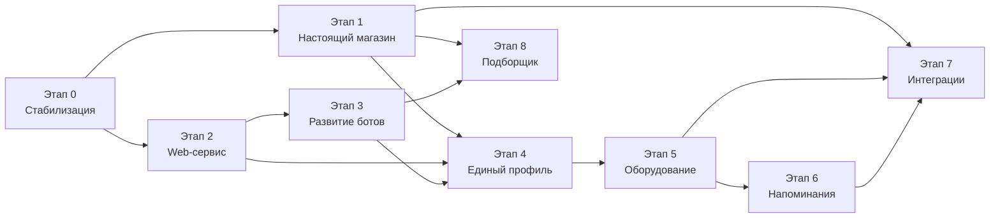

# Roadmap VITMA MARKET

## Phase zero storage status

- E0-08: implemented with explicit file FKs, policies and legacy backfill.
- E0-10: minimal audit implemented; broader transaction-scoped coverage remains hardening work.
- E0-12: offline create/verify/restore implemented and drilled.

## 1. Принципы roadmap

Roadmap построен вертикальными сценариями. Каждый этап должен оставлять систему в рабочем состоянии и давать проверяемый пользовательский результат.

Обозначения:

- **P0** - блокирует безопасный запуск или следующий вертикальный сценарий;
- **P1** - обязательная продуктовая ценность ближайшего рабочего релиза;
- **P2** - полезное развитие после основного сценария;
- **S/M/L/XL** - относительная сложность, не календарный срок.

Продуктовый порядок сохраняется:

1. настоящий магазин;
2. настоящие web-сервисные заявки;
3. развитие ботов.

Перед ними выполняется только ограниченный технический этап 0. Он не должен превращаться в полную выплату технического долга.

## 2. Зависимости этапов

Этапы 1 и 2 могут частично идти независимо после общего этапа 0, но рекомендуемый продуктовый порядок - сначала завершить заказ-заявку, затем сервисную заявку.

## 3. Этап 0. Стабилизация основы

**Приоритет:** P0
**Сложность:** L
**Цель:** сделать существующую систему управляемой и безопасной для дальнейших публичных функций без массового рефакторинга.

### Статус утверждённых пачек на 2026-07-26

| Задача | Статус | Результат |
|---|---|---|
| E0-01 | завершена | Versioned schema report: 20 фактических таблиц, 18 entities, 2 legacy-таблицы, orphan links |
| E0-02 | завершена | Clean baseline migration, application/test DataSource и migration CLI |
| E0-03 | завершена | `synchronize: false`, обязательная DB-конфигурация, offline polling switch |
| E0-04 | завершена | Без fallback/query/static token; явный CLI superadmin, server-side sessions, CSRF |
| E0-05 | завершена | Multi-role RBAC, staff management и read-only assigned engineer view |
| E0-06 | завершена | Server-generated anonymous web identity и HttpOnly session |
| E0-07 | завершена | Глобальная DTO-валидация и единый error contract |
| E0-09 | завершена | Rate limits, CORS, Helmet, Swagger policy, health и body limits |
| базовая часть E0-11 | завершена | Отдельная `*_test` БД; 14 unit и 16 PostgreSQL integration/characterization tests |
| E0-08 | не начата | FileStorage foundation остаётся блокирующей перед публичными upload/download |
| E0-10 | не начата | Audit Log остаётся обязательным перед production |
| E0-12 | не завершена | Выполнена только одноразовая страховочная копия и restore drill; FileStorage и повторяемый full backup отсутствуют |

Старая локальная `db` объявлена тестовой и не мигрировалась. Эталоном development является `vitma_dev`, integration tests используют отдельную `vitma_e0_test`. Обе схемы имеют `InitialSchema1785067383157` и `SecurityFoundation1785079000000`; `bids` и `bid_fields` сохранены только в старой БД/dump до отдельного решения.

### Пользовательская ценность

- существующие анкеты, вопросы и заявки не теряются при обновлении;
- клиент не может получить чужие данные подменой `chatId`;
- сотрудник входит с реальной учётной записью и имеет ограниченные права;
- вложение не может бесконтрольно занять память/диск;
- backup восстанавливает БД и связанные файлы.

### Вертикальный сценарий

1. Оператор продолжает видеть существующие обращения.
2. Клиент создаёт тестовый вопрос/регистрацию через существующий канал.
3. Backend валидирует запрос и сохраняет данные по мигрируемой схеме.
4. Файл проходит ограничения и получает безопасный ID.
5. Сотрудник выполняет разрешённое действие.
6. Действие записывается в аудит.
7. Backup/restore возвращает сущность и файл.

### Объём

- baseline миграция фактической БД;
- `synchronize: false`;
- минимальные DTO и глобальный `ValidationPipe` для публичных/admin mutation routes;
- удаление небезопасных auth defaults;
- secure session configuration;
- роли `operator`, `engineer`, `sales_manager`, `superadmin` и минимальные policies;
- анонимная web-сессия и opaque token foundation;
- `StoredFile` и `FileStoragePort`;
- лимиты uploads и безопасные имена;
- rate limiting критичных публичных маршрутов и логина;
- production-флаг Swagger/CORS/cookie;
- минимальный audit log;
- тестовый PostgreSQL harness;
- backup/restore БД и файлов;
- устранение duplicate service-request controller после contract test.

### Затрагиваемые модули

- `AppModule`, config и bootstrap;
- database/migrations;
- admin auth;
- client identity;
- files/storage;
- public controllers;
- users;
- tickets/registrations/service requests;
- test/infrastructure.

### Изменения базы

- таблица миграций;
- nullable foundation-поля канонического клиента;
- `customer_web_sessions` или эквивалент;
- `stored_files`;
- `audit_events`;
- staff roles/assignments, если текущего `AdminUser.role` недостаточно;
- индексы и FK только после проверки исторических данных.

### Новые API

- создание/обновление анонимной web-сессии через cookie;
- безопасные upload/download endpoints;
- staff session management;
- health/readiness;
- без новых продуктовых API.

### Клиентский сайт

- перестаёт отправлять произвольный `chatId` как credential;
- получает/использует web-session cookie;
- сохраняет текущий mock-магазин до этапа 1.

### Админка

- использует только session auth;
- показывает отсутствие права корректным состоянием;
- может сохранить текущий набор экранов.

### Боты

- работающие сценарии не меняются;
- identity lookup переводится на совместимый channel service;
- добавляются characterization tests;
- polling/runtime logic не переписывается.

### Зависимости

- доступ к копии фактической PostgreSQL;
- backup перед baseline;
- согласование production secrets и ролей;
- выбор лимитов файлов и защищённого volume.

### Риски

- фактическая schema drift из-за `synchronize`;
- исторические orphan IDs;
- ошибочная автоматическая baseline migration;
- потеря доступа старого администратора;
- несовместимость старых локальных путей файлов.

### Критерии приёмки

- новая чистая БД разворачивается миграциями;
- копия существующей БД обновляется без потери строк;
- постоянное окружение запускается с `synchronize: false`;
- startup без сотрудников выводит предупреждение и не создаёт известную учётную запись;
- `chatId` из другого клиента не даёт доступ к обращению;
- operator не выполняет superadmin-only endpoint;
- файл выше лимита и запрещённого типа отклоняется;
- filename не влияет на object key/path;
- Swagger закрыт или отключён production-флагом;
- backup + restore возвращает выбранную запись и файл;
- существующие Telegram/MAX smoke-сценарии проходят.

### Тесты

- migration test на чистой и snapshot БД;
- auth/RBAC integration;
- IDOR/security API;
- upload policy;
- backup/restore drill;
- bot characterization;
- build/typecheck/non-fixing lint по изменённым модулям.

### Сознательно не входит

- форматирование всего backend;
- полный рефакторинг update-классов;
- внешний object storage;
- полноценный личный кабинет;
- магазин;
- новая сервисная форма;
- SMS;
- 1С/АТОЛ/ОФД.

## 4. Этап 1. Настоящий магазин

**Приоритет:** P1
**Сложность:** XL
**Цель:** провести заказ от редактируемого товара до обработки менеджером и выдачи счёта клиенту.

### Пользовательская ценность

- клиент видит актуальный каталог из backend;
- отправляет реальный заказ-заявку;
- менеджер получает заказ в общей админке;
- счёт и статусы доступны клиенту;
- история действий сохраняется.

### Вертикальный сценарий

1. Менеджер создаёт бренд, категорию и товар.
2. Загружает изображение, характеристики, цену и отображаемое наличие.
3. Публикует товар.
4. Товар появляется в каталоге и поиске.
5. Клиент добавляет товары в корзину и оформляет заказ.
6. Backend создаёт `Order` и snapshot позиций.
7. Менеджер видит новый заказ и назначается ответственным.
8. Менеджер уточняет детали, вручную создаёт документы в 1С.
9. Менеджер загружает счёт.
10. Клиент получает безопасную ссылку/видит документ в странице заказа.
11. Менеджер отмечает оплату и меняет этап комплектации.
12. Клиент видит упрощённый статус.
13. Все изменения остаются в истории заказа.

### Объём

- все сущности первого релиза Catalog/Order;
- CRUD каталога в admin;
- публикация/скрытие;
- public catalog API;
- поиск, фильтры и пагинация на backend;
- order checkout с idempotency key;
- order status machine;
- manager assignment;
- comments/documents/history;
- защищённая страница заказа;
- отправка документа через подтверждённый канал, если он привязан.

### Затрагиваемые модули

- новые `catalog`, `orders`;
- files;
- customer/organizations;
- notifications foundation;
- admin-ui;
- client-ui;
- audit.

### Изменения базы

- `product_categories`;
- `brands`;
- `products`;
- `product_images`;
- `product_attributes`;
- `product_prices`;
- `product_availability`;
- `delivery_methods`;
- `customer_contacts`;
- `orders`;
- `order_items`;
- `order_status_history`;
- `order_documents`;
- `order_comments`;
- индексы SKU, slug, publication/status, order number.

### Новые API

Публичные:

- `GET /api/catalog/categories`;
- `GET /api/catalog/products`;
- `GET /api/catalog/products/:slug`;
- `POST /api/orders`;
- `GET /api/orders/:number` с public token/session;
- `GET /api/orders/:number/documents/:id`.

Административные:

- CRUD категорий, брендов, товаров;
- images/attributes/price/availability/publication;
- список и карточка заказов;
- assignment/status/comment/document;
- история.

### Клиентский сайт

- `catalog.ts` перестаёт быть источником production-данных;
- состояния loading/error/empty;
- серверные фильтры и поиск;
- корзина остаётся локальной до checkout;
- checkout отправляет позиции и контакты;
- success page показывает номер и безопасную ссылку;
- order status/document page.

### Админка

- вкладка «Каталог»;
- редактор товара;
- вкладка «Заказы» с master-detail;
- назначение менеджера;
- статусы и внутренние комментарии;
- загрузка/выдача счёта;
- история.

### Боты

- не обязательны для первого прохода;
- при подтверждённой привязке могут отправить уведомление/счёт через общий notification port;
- магазин не внедряется в bot update-классы.

### Зависимости

- этап 0;
- согласование НДС/отображения цены;
- реальные delivery methods;
- решение о доступе анонимного клиента к счёту;
- справочник менеджеров.

### Риски

- попытка превратить `ProductAvailability` в склад 1С;
- изменение цены после заказа;
- дубли checkout при повторе;
- утечка счёта по последовательному номеру;
- большие изображения;
- несогласованные статусы менеджера и клиента.

### Критерии приёмки

- опубликованный товар из admin отображается на сайте без deploy frontend;
- скрытый товар недоступен в каталоге;
- цена и название в старом заказе не меняются после редактирования товара;
- повтор запроса с тем же idempotency key не создаёт второй заказ;
- заказ виден менеджеру;
- счёт загружается только разрешённым сотрудником;
- чужой public token не открывает заказ;
- клиент видит корректный статус и документ;
- вся история содержит actor, время и переход;
- каталог из 20+ товаров импортирован/внесён в PostgreSQL;
- mock order flow отключён в рабочей конфигурации.

### Тесты

- catalog repository/API;
- publish visibility;
- checkout validation/idempotency;
- order transition matrix;
- RBAC manager/operator;
- file access;
- browser E2E полного вертикального сценария;
- responsive catalog/cart/checkout;
- migration test.

### Сознательно не входит

- интернет-эквайринг;
- реальный склад и резервы;
- автоматическое создание документа 1С;
- варианты товара;
- промокоды;
- возвраты как отдельный workflow;
- синхронизация остатков.

## 5. Этап 2. Клиентские сервисные заявки

**Приоритет:** P1
**Сложность:** XL
**Цель:** заменить mock web-форму настоящей заявкой, совместимой с ботами и рабочей админкой.

### Пользовательская ценность

- клиент заполняет структурированную заявку и прикладывает файлы;
- получает непредсказуемую безопасную ссылку;
- оператор видит полные поля и вложения;
- клиент получает реальный статус и ответ.

### Вертикальный сценарий

1. Superadmin/оператор включает тип услуги и версию формы.
2. Клиент открывает форму на сайте.
3. Backend отдаёт определение формы.
4. Клиент заполняет контакты, организацию, оборудование, проблему и формат помощи.
5. Файлы загружаются и привязываются к draft.
6. Submit создаёт реальную заявку с номером и public token.
7. Оператор видит структурированные ответы.
8. Оператор назначает инженера/уточняет данные/меняет статус.
9. Ответ и клиентский статус появляются на безопасной web-странице.
10. Оператор может создать ту же модель заявки вручную после звонка.
11. События и документы сохраняются.

### Объём

- расширение существующей `ServiceRequest`;
- source, location, equipment, assignees;
- versioned form definitions;
- structured answers;
- attachments;
- internal/customer status split;
- public token;
- transition service;
- manual admin creation;
- web conversation/status feed;
- миграция существующих заявок без потери.

### Затрагиваемые модули

- service requests;
- form definitions;
- files;
- customers/organizations;
- conversations;
- notifications;
- admin-ui;
- client-ui;
- audit.

### Изменения базы

- form definitions/versions;
- новые поля и FK service request;
- attachments/documents/comments;
- public token hash;
- status history/transition event enrichment;
- staff assignments;
- optional customer contact snapshot.

### Новые API

- public service type/form schema;
- create draft;
- upload/remove attachment;
- submit;
- secure status/history/messages;
- admin manual create;
- transition/assign/comment/document/result.

### Клиентский сайт

- удаляет преобразование полей в summary string;
- отправляет типизированные данные;
- отправляет файлы;
- показывает ошибки backend по полям;
- реальный success/status;
- безопасное продолжение draft по web-session.

### Админка

- рендерит поля по snapshot schema;
- inline preview изображений и безопасные downloads;
- internal/customer status;
- назначение сотрудника как relation;
- ручная заявка;
- результат работы и документы.

### Боты

- существующие заявки продолжают работать через compatibility adapter;
- их переписывание на form engine относится к этапу 3;
- новые статусы не должны ломать invoice/payment/visit.

### Зависимости

- этап 0;
- status mapping;
- роли operator/engineer;
- file foundation;
- решение о публичной ссылке и web-session.

### Риски

- попытка одномоментно заменить все bot flows;
- потеря старых `answers`;
- несовместимость invoice/payment статусов;
- неограниченная схема form JSON;
- раскрытие персональных данных через status endpoint.

### Критерии приёмки

- web-форма не использует `localStorage` как конечное хранилище;
- каждое поле доступно оператору отдельно;
- до пяти разрешённых файлов сохраняются и открываются;
- номер заявки не является credential;
- клиент видит только customer-facing status;
- оператор создаёт заявку после звонка;
- назначенный инженер видит задачу в своём представлении;
- старые заявки отображаются;
- текущие Telegram/MAX заявки продолжают создаваться;
- mock status отключён в рабочей конфигурации.

### Тесты

- form schema validation;
- conditional fields;
- draft/submit idempotency;
- attachments;
- status mapping and transitions;
- IDOR/public token;
- manual creation;
- old request compatibility;
- browser E2E;
- bot regression smoke.

### Сознательно не входит

- полноценный личный кабинет;
- SMS;
- напоминания ФН/ОФД;
- сложный BPM designer;
- инженер-клиент direct chat;
- автоматизация 1С.

## 6. Этап 3. Развитие ботов

**Приоритет:** P1
**Сложность:** L
**Цель:** добавлять типовые услуги один раз и отображать их в Telegram, MAX и web без копирования бизнес-переходов.

### Пользовательская ценность

- одинаковые услуги и правила во всех каналах;
- новый тип заявки быстрее появляется в продукте;
- существующие анкеты, PDF, чат и медиа остаются рабочими.

### Вертикальный сценарий

1. Superadmin создаёт/публикует типовую форму услуги.
2. Она появляется в разрешённых каналах.
3. Telegram/MAX renderer показывает те же шаги.
4. Backend валидирует ответы и сохраняет одну модель.
5. Оператор получает одинаковую карточку независимо от источника.
6. Сложный handler выполняет цену/PDF, если указан.

### Объём

- form application service;
- channel-neutral next-step/result model;
- Telegram renderer;
- MAX renderer;
- web renderer contract;
- custom handler registry;
- durable conversation/form state;
- перенос simple flows;
- перенос ФН;
- перенос АТОЛ;
- унификация media ingestion;
- удаление дублирования только после parity tests.

### Затрагиваемые модули

- service requests/forms;
- client workflow;
- Telegram/MAX;
- user context;
- messenger;
- files;
- admin service type settings.

### Изменения базы

- form run/draft state;
- form version link;
- optional channel progress;
- inbound update idempotency keys.

### Новые API

- admin form/type management;
- channel-neutral start/answer/resume commands;
- внешние bot endpoints не обязательны при polling.

### Клиентский сайт

- использует тот же form schema;
- не содержит копии service field definitions.

### Админка

- управление простыми типами/версиями;
- preview формы;
- channel visibility;
- custom handler выбирается только из разрешённого registry.

### Боты

- основная область изменений;
- SDK-specific parsing остаётся в adapters;
- тексты/кнопки строятся renderer;
- business service не знает Telegraf/MAX types.

### Зависимости

- этап 2 form model;
- characterization tests текущих сценариев;
- список первых новых типов услуг.

### Риски

- чрезмерный универсальный конструктор;
- различия возможностей Telegram/MAX;
- потеря resume после deploy;
- callback payload compatibility;
- повтор messenger update.

### Критерии приёмки

- simple flow описан один раз;
- один новый тип без custom handler работает в трёх каналах;
- ФН сохраняет расчёт/подтверждение/счёт;
- АТОЛ сохраняет PDF/upload/cancel;
- состояние переживает restart;
- повтор update не дублирует ответ;
- parity tests Telegram/MAX проходят;
- старые callback в активных сообщениях обрабатываются или корректно устаревают.

### Тесты

- form engine unit;
- renderer snapshots/contracts;
- custom handlers;
- restart/resume;
- duplicate update;
- media adapter;
- messenger outage;
- Telegram/MAX manual smoke.

### Сознательно не входит

- визуальный drag-and-drop BPM;
- пользовательские скрипты;
- AI;
- автоматическое создание произвольных процессов без разработчика;
- перенос всей регистрации ККТ в service request.

## 7. Этап 4. Единый профиль клиента

**Приоритет:** P1
**Сложность:** XL
**Цель:** один подтверждённый клиент с несколькими каналами, организациями и историей.

### Пользовательская ценность

- клиент видит заказы и заявки независимо от канала;
- может привязать Telegram/MAX/email;
- не теряет историю;
- представляет несколько организаций.

### Вертикальный сценарий

1. Клиент входит доступным подтверждённым способом.
2. Привязывает Telegram/MAX по nonce.
3. Видит свои заказы, заявки и документы.
4. Запрашивает связь с организацией.
5. После подтверждения видит организационные обращения и оборудование.
6. Выбирает канал уведомлений.

### Объём

- canonical customer migration;
- verified channels;
- web account/session;
- optional email verification;
- SMS provider port без обязательного provider;
- organization invitations/verification;
- merge workflow;
- customer cabinet;
- preferences.

### Затрагиваемые модули

- users/identity;
- organizations;
- orders и service requests;
- registrations/tickets;
- admin auth и audit;
- client-ui;
- Telegram/MAX adapters;
- notifications/preferences.

### Изменения базы

- canonical customer fields;
- verified channels;
- web sessions;
- verification challenges;
- merge events;
- organization permissions;
- notification preferences.

### Новые API

- account/session/profile;
- create/consume channel link challenge;
- link/unlink confirmed channel;
- organization invite/request/approve;
- customer history;
- merge preview/execute для superadmin.

### Клиентский сайт

- вход и восстановление сессии;
- профиль и подтверждённые каналы;
- кабинет заказов/заявок/документов;
- организации и запрос членства;
- настройки уведомлений.

### Админка

- поиск канонического клиента;
- preview связанных каналов и истории;
- approve/reject organization membership;
- merge preview, conflicts и audit;
- управление staff-only disputed cases.

### Боты

- deep-link команда подтверждения канала;
- одноразовое применение nonce;
- отображение результата привязки;
- текущие service/registration commands используют канонический customer context.

### Зависимости

- этапы 1 и 2;
- identity foundation этапа 0;
- политика организации;
- email/SMS решения могут быть отложены.

### Риски

- ошибочное объединение;
- захват организации по ИНН;
- конфликт истории;
- потеря legacy user IDs;
- отсутствие SMS provider.

### Критерии приёмки

- один профиль содержит web+Telegram+MAX после подтверждения;
- автоматического merge по совпадению телефона нет;
- merge транзакционен и аудитирован;
- клиент видит только свои/разрешённые данные;
- существующие записи сохранены;
- отсутствие SMS не блокирует messenger linking и anonymous order/service access.

### Тесты

- channel verification;
- merge conflicts;
- organization permissions;
- session security;
- legacy backfill;
- account E2E.

### Не входит

- SSO;
- сложная корпоративная IAM;
- бухгалтерский кабинет;
- кабинет руководителя.

## 8. Этап 5. Учёт оборудования

**Приоритет:** P2
**Сложность:** XL
**Цель:** общая история торговых точек, любого оборудования и обслуживания.

### Пользовательская ценность

- оператор не собирает сведения о кассе заново при каждом обращении;
- инженер видит точное оборудование и историю работ;
- клиент видит связанные активы своей организации;
- ФН, ОФД, гарантия и лицензии имеют единый источник данных.

### Вертикальный сценарий

1. Оператор создаёт торговую точку организации.
2. Добавляет оборудование или связывает его из регистрации/заявки.
3. Для ККТ добавляет ФН и ОФД.
4. Инженер открывает назначенную заявку по оборудованию.
5. После выполнения создаётся maintenance event.
6. Клиент и оператор видят историю.

### Объём

- Location/Outlet;
- generic Equipment;
- KKT details;
- FN/OFD/software licenses;
- warranty;
- maintenance history;
- links to orders/service/registration/documents;
- migration текущих assets.

### Затрагиваемые модули

- organizations;
- новый equipment module;
- текущий assets module;
- registrations;
- service requests;
- orders;
- files/documents;
- admin-ui и client-ui.

### Изменения базы

- `locations`;
- `equipment`;
- `kkt_details`;
- обновлённые `fiscal_drives` и `ofd_subscriptions`;
- `software_licenses`;
- `maintenance_events`;
- связи service/order/registration с equipment;
- mapping и backfill текущих cash register IDs.

### Новые API

- organization locations CRUD;
- equipment CRUD/search/detail;
- KKT/FN/OFD/license operations;
- equipment maintenance history;
- link/unlink request/registration/order to equipment.

### Клиентский сайт

- оборудование организации в кабинете;
- карточка оборудования и история;
- создание заявки с выбранным equipment;
- права доступа через organization membership.

### Админка

- торговые точки;
- поиск/карточка любого оборудования;
- специализированный блок ККТ;
- связь обращения с equipment;
- maintenance timeline;
- duplicate/merge tools только для superadmin.

### Боты

- выбор ранее привязанного оборудования при создании заявки;
- возможность пропустить выбор для разового клиента;
- channel renderer получает equipment options из backend;
- текущие сценарии без организации продолжают работать.

### Зависимости

- единый профиль и организации;
- сервисные заявки;
- staff assignments.

### Риски

- дубли оборудования;
- серийный номер не всегда глобально уникален;
- попытка заменить 1С;
- неполные старые данные.

### Критерии приёмки

- не-ККТ оборудование поддерживается без новых таблиц на каждый тип;
- ККТ имеет специализированные поля;
- старые CashRegister/FN/OFD данные доступны;
- service request связывается с equipment;
- maintenance event создаётся из завершённой работы;
- права организации соблюдаются.

### Тесты

- equipment identity/dedup;
- migration;
- organization visibility;
- service linkage;
- maintenance history.

### Не входит

- автоматический ATOL/OFD sync;
- склад;
- телеметрия в реальном времени.

## 9. Этап 6. Напоминания

**Приоритет:** P2, высокая бизнес-ценность после данных оборудования
**Сложность:** L
**Цель:** надёжно предупреждать об окончании ФН и ОФД и создавать задачу оператору при недоставке.

### Пользовательская ценность

- клиент заранее узнаёт о критичном сроке;
- компания получает повторяемый сервисный контакт;
- оператор видит только случаи, которые автоматическая доставка не закрыла;
- история исключает споры о том, было ли сообщение отправлено.

### Вертикальный сценарий

1. У ФН/ОФД есть дата окончания.
2. Backend создаёт durable scheduled events по rule set.
3. В нужный момент создаётся notification.
4. Dispatcher выбирает подтверждённый канал.
5. Доставка и попытки сохраняются.
6. Повтор не создаёт дубль.
7. После окончательной ошибки создаётся задача оператору.
8. Клиент может перейти к сервисной заявке/продлению.

### Объём

- scheduled events;
- notification/template/delivery;
- Postgres worker;
- Telegram/MAX/email adapters;
- retries/idempotency;
- preferences;
- operator escalation;
- admin monitoring.

### Затрагиваемые модули

- equipment;
- identity/channels/preferences;
- notifications/jobs;
- messenger adapters;
- service requests;
- admin operator tasks;
- audit/logging.

### Изменения базы

- `scheduled_events`;
- `notification_templates`;
- `notifications`;
- `notification_deliveries`;
- `notification_preferences`;
- `operator_tasks`;
- unique idempotency keys и job indexes.

### Новые API

- admin rule/template management;
- pending/failed delivery monitoring;
- retry/cancel notification;
- customer notification preferences;
- create service request from reminder context.

### Клиентский сайт

- настройки разрешённых каналов;
- история обязательных сервисных уведомлений;
- переход из напоминания к предзаполненной заявке;
- отсутствие marketing opt-in по умолчанию.

### Админка

- список due/failed notifications;
- карточка попыток доставки;
- operator task после dead letter;
- управление rule set/template с preview;
- ручное отключение ошибочного scheduled event.

### Боты

- принимают только готовую channel-neutral delivery command;
- показывают кнопку перехода к услуге;
- не содержат cron/дат;
- provider result возвращается notification dispatcher.

### Зависимости

- этап 5;
- подтверждённые каналы этапа 4;
- даты/качество данных.

### Риски

- дубли рассылки;
- неправильная дата;
- смешение маркетинга и service notices;
- блокировка worker;
- ограничения messenger provider.

### Критерии приёмки

- повтор worker не дублирует сообщение;
- история попыток видна;
- канал fallback управляем;
- opt-out соблюдается;
- недоставка создаёт одну задачу оператору;
- ссылка создаёт предзаполненную заявку.

### Тесты

- due job locking;
- idempotency;
- retries/dead letter;
- preferences;
- adapter outage;
- timezone/date boundaries.

### Не входит

- SMS без provider;
- рекламные кампании;
- сложный marketing automation.

## 10. Этап 7. Интеграции

**Приоритет:** P2
**Сложность:** XL на каждый адаптер
**Цель:** сократить ручной ввод, не превращая проект в замену 1С.

### Пользовательская ценность

- менеджер не дублирует вручную весь каталог;
- оператор получает более актуальные сведения об оборудовании и сроках;
- ошибки синхронизации видны и не портят предметные данные молча;
- основной продукт продолжает работать при недоступности внешней системы.

### Рекомендуемый порядок

1. CSV/XLSX import каталога из 1С.
2. Экспорт заказа-заявки/отчёта для менеджера.
3. Проверка доступности и договора API АТОЛ.
4. Проверка API партнёрского ОФД.
5. Только затем direct adapters.

### Вертикальный сценарий импорта

1. Менеджер выгружает файл из 1С.
2. Загружает его в admin.
3. Система валидирует и показывает preview.
4. Менеджер подтверждает.
5. Товары/цены обновляются по mapping/SKU.
6. Ошибки доступны отчётом.
7. Повтор файла не создаёт дублей.

### Объём

- integration ports;
- staging/import runs;
- mapping;
- dry run;
- idempotency;
- audit;
- позже provider adapters.

### Затрагиваемые модули

- catalog;
- orders;
- organizations;
- equipment;
- files;
- integrations/staging;
- jobs/outbox;
- admin-ui.

### Изменения базы

- `integration_runs`;
- `integration_errors`;
- `external_mappings`;
- `import_staging_rows`;
- provider cursors/checkpoints;
- source metadata на импортируемых сущностях.

### Новые API

- upload/validate/preview/apply import;
- download import report;
- list/retry/cancel integration runs;
- external mapping conflict resolution;
- export order request;
- provider sync trigger/status после появления адаптера.

### Клиентский сайт

- новых integration-specific экранов не требуется;
- показывает только опубликованные и успешно применённые данные;
- источник/ошибка интеграции никогда не раскрывает секреты клиенту.

### Админка

- мастер импорта с dry run;
- preview create/update/skip/error;
- mapping conflicts;
- журнал runs;
- provider health без отображения secrets;
- ручной retry/disable.

### Боты

- напрямую с 1С/АТОЛ/ОФД не работают;
- используют обновлённые предметные данные через существующие services;
- при sync outage продолжают принимать заявки.

### Зависимости

- магазин;
- оборудование;
- реальные форматы и доступы.

### Риски

- неустойчивый CSV/XLSX формат;
- конфликт систем-владельцев;
- недокументированный API;
- массовое ошибочное обновление цен;
- секреты партнёрских кабинетов.

### Критерии приёмки

- импорт имеет preview и отчёт;
- нет молчаливого удаления;
- повтор безопасен;
- источник каждого поля понятен;
- external outage не блокирует основной продукт;
- secret хранится вне кода.

### Тесты

- parser fixtures;
- dry run/apply;
- malformed file;
- mapping conflict;
- duplicate run;
- adapter contract.

### Не входит

- собственный склад;
- бухгалтерские проводки;
- guaranteed direct API до проверки доступа.

## 11. Этап 8. Подборщик и автоматизации

**Приоритет:** P2
**Сложность:** L
**Цель:** rule-based помощник формирует объяснимый комплект и передаёт его в корзину/менеджеру.

### Пользовательская ценность

- клиент получает понятный короткий путь к подходящему комплекту;
- менеджер получает уже структурированные требования;
- рекомендацию можно объяснить и воспроизвести;
- правила меняются без deploy исходного кода.

### Вертикальный сценарий

1. Superadmin редактирует вопросы/варианты/правила.
2. Клиент отвечает на вопросы.
3. Rule engine вычисляет требования.
4. Система показывает категории, модели/комплекты и объяснение.
5. Клиент добавляет комплект в корзину или отправляет менеджеру.
6. Ответы сохраняются вместе с заказом/лидом.

### Объём

- versioned questionnaire;
- deterministic rule engine;
- rule validation;
- recommendation result;
- catalog links;
- admin editor с preview;
- analytics событий.

### Затрагиваемые модули

- product selector/rules;
- catalog;
- cart/orders;
- form rendering;
- admin-ui;
- client-ui;
- audit/analytics events.

### Изменения базы

- `selector_definitions`;
- `selector_versions`;
- versioned rules/questions/outcomes;
- `selector_runs`;
- result snapshots и links к order/manager lead.

### Новые API

- public get published selector;
- submit answers/evaluate;
- add result bundle to cart;
- send result to manager;
- admin draft/validate/preview/publish/version history.

### Клиентский сайт

- пошаговые вопросы;
- требования и объяснение;
- несколько моделей/комплектов;
- add-to-cart;
- отправка результата менеджеру.

### Админка

- редактор вопросов/ответов/правил;
- validation конфликтов и циклов;
- preview на тестовых ответах;
- version publish/rollback by new version;
- статистика завершённых runs.

### Боты

- могут использовать тот же form renderer после web-версии;
- подборщик не должен дублировать правила в update-классах;
- bot-канал можно включить отдельным visibility flag;
- запуск в ботах не является обязательным для первого selector release.

### Зависимости

- настоящий каталог;
- стабильные product attributes;
- form renderer может переиспользоваться из этапа 3.

### Риски

- противоречивые правила;
- рекомендация скрытого/недоступного товара;
- неясное объяснение;
- смешение service form и product rules.

### Критерии приёмки

- одинаковые ответы всегда дают одинаковый результат;
- каждое предложение содержит объяснение;
- rule set версионируется;
- скрытые товары не рекомендуются;
- комплект добавляется в корзину;
- результат отправляется менеджеру.

### Тесты

- rule fixtures;
- конфликт/цикл;
- versioning;
- catalog availability;
- browser E2E.

### Не входит

- AI/ML/LLM;
- генерация свободного текста моделью;
- автоматическая закупка.

## 12. Сквозные критерии готовности каждого этапа

Этап считается завершённым только если:

- vertical scenario проходит end-to-end;
- миграция проверена на чистой и копии предыдущей схемы;
- права проверяются backend;
- есть loading/error/empty/success состояния;
- нет секретов во frontend;
- критичные действия аудитируются;
- файлы защищены;
- добавлены unit/integration/E2E тесты по риску;
- production build проходит;
- non-fixing lint/typecheck проходят для новых и изменённых модулей;
- документация API и запуска обновлена;
- есть rollback/restore план;
- явно отключён соответствующий mock в рабочей конфигурации.

## 13. Первый рекомендуемый product slice

После принятия ограниченного этапа 0 первым продуктовым сценарием должен быть:

> Менеджер создаёт и публикует товар, клиент видит его в каталоге, оформляет заказ-заявку, менеджер получает заказ, загружает счёт, клиент безопасно получает документ, а история заказа сохраняется.

Этот сценарий:

- соответствует главному бизнес-приоритету;
- не зависит от SMS;
- не требует эквайринга;
- не требует direct 1С API;
- проверяет каталог, заказ, файлы, роли, admin и client frontend в одном завершённом потоке.
# Phase 0 completion package

- E0-13: required CI jobs passed on GitHub-hosted runners in
  [run 30332957415](https://github.com/cltvv1/market-bot/actions/runs/30332957415)
  for commit `5178035fa2ef79371c9b22339b997c011bbedb7e`.
- E0-14: duplicate public service-request handlers removed and guarded by metadata test.
- E0-15: production React mode and development-only explicit legacy mode implemented.

The full backup/restore drill passed locally. Its manual GitHub workflow still
needs one operator-triggered run after the workflow reaches the default branch,
so Stage 0 is code-complete and required-CI-verified but not yet fully
hosted-drill-verified.

The recommended next package is the first real shop vertical slice described
later in this document. It was deliberately not started here.
