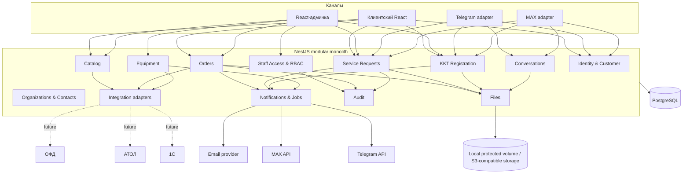
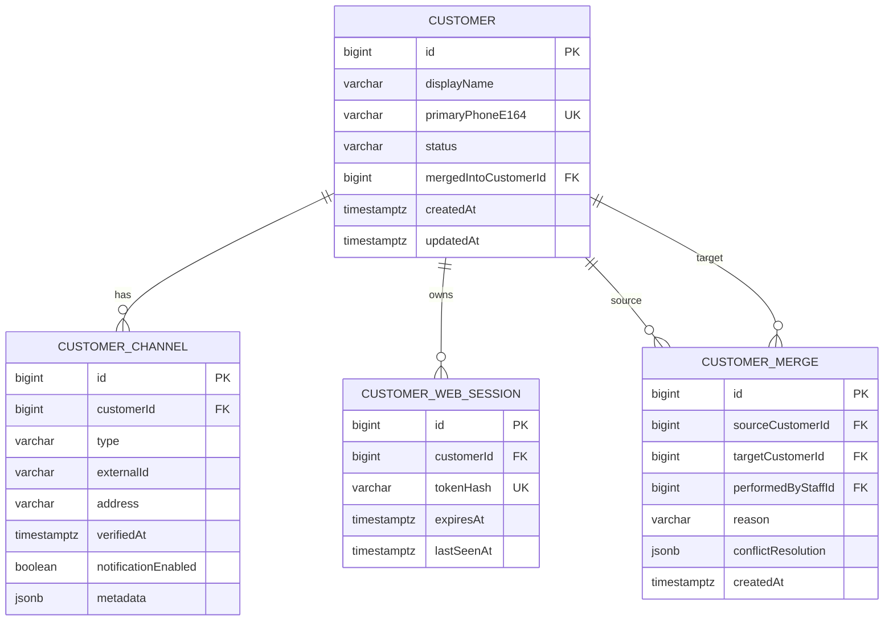
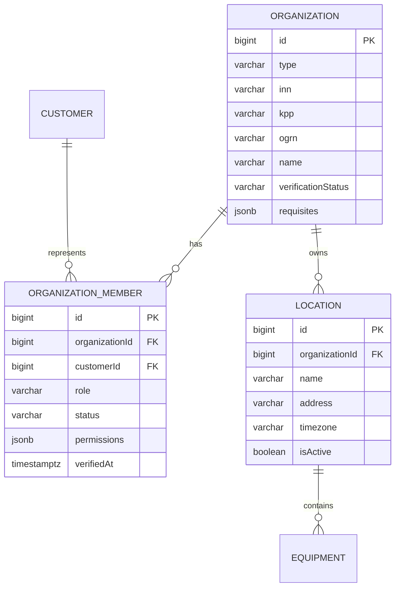
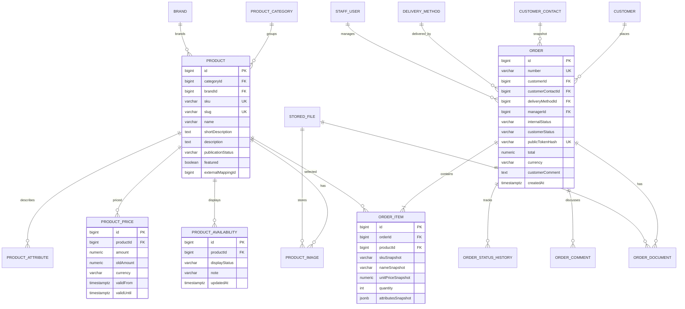
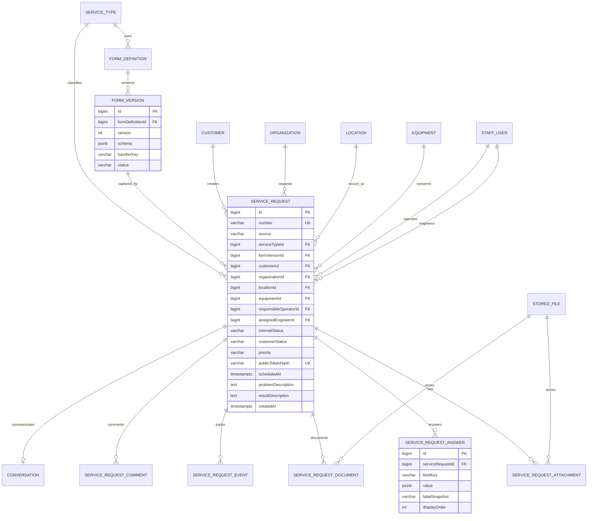
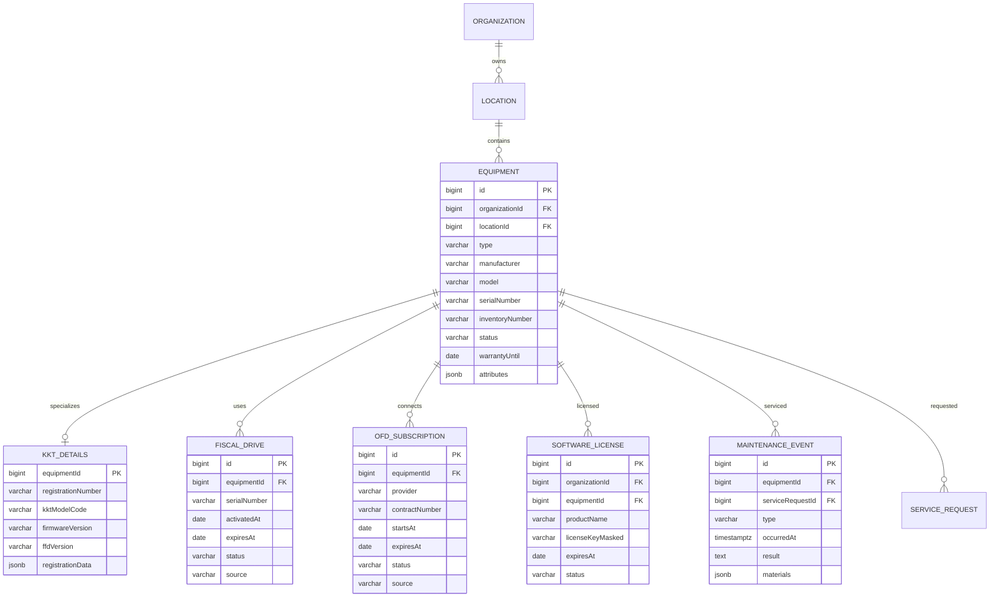
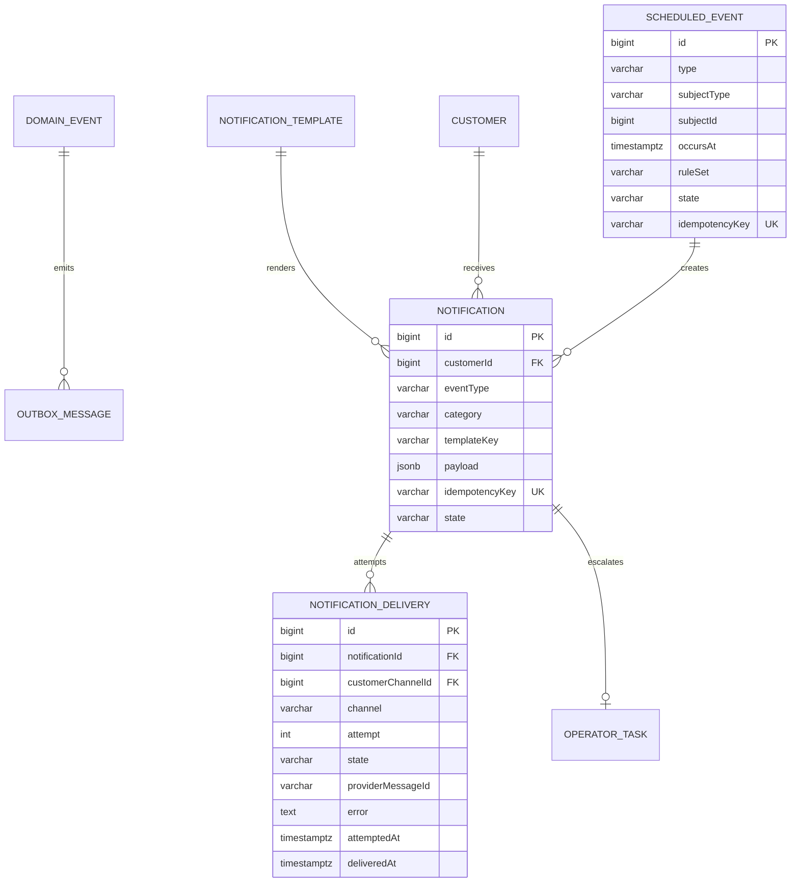

# Целевая архитектура VITMA MARKET

## Storage and audit foundation

Domain modules use `FilesService`/`FileStoragePort`; there is no public universal file-by-ID endpoint. Local storage is the phase-zero provider. Audit is append-only and superadmin-readable. PostgreSQL and storage use a coordinated offline backup set.

## Реализованная foundation на 2026-07-26

Следующие части этой целевой архитектуры уже реализованы:

- TypeORM migrations и `synchronize: false`;
- Staff Access с server-side cookie sessions и централизованным RBAC;
- несколько ролей на одного сотрудника;
- минимальное назначение инженера на сервисную заявку;
- анонимная server-side web-сессия, не доверяющая browser `platform/chatId`;
- DTO/глобальная валидация и стабильный error contract;
- CORS allowlist, Helmet, route rate limits, body limits, liveness/readiness и production policy Swagger.

Пока не реализованы E0-08 FileStorage, E0-10 Audit Log и E0-12 full backup/restore. Описанные ниже канонический Customer, личный кабинет, outbox и product modules остаются целевой архитектурой, а не текущим кодом.

## 1. Архитектурные принципы

Целевая форма проекта:

- модульный монолит NestJS;
- одна PostgreSQL;
- отдельные React-приложения клиентского сайта и админки;
- Telegram и MAX как адаптеры одного прикладного ядра;
- файловое хранилище за интерфейсом `FileStorage`;
- внешние системы за изолированными адаптерами;
- транзакционный outbox для надёжных внешних действий;
- миграции вместо автоматической синхронизации схемы.

Не требуется:

- отдельный backend или база для каждого бота;
- переход на микросервисы;
- собственный бухгалтерский или складской учёт;
- замена 1С;
- универсальный BPM-конструктор;
- новая инфраструктура только ради архитектурной чистоты.

## 2. Контекстная схема



## 3. Границы модулей

### 3.1 Identity & Customer

Ответственность:

- единый клиент;
- подтверждённые каналы;
- анонимная web-сессия;
- привязка Telegram/MAX/email;
- слияние дублей;
- предпочтения связи.

Не отвечает за:

- роли сотрудников;
- права представителя организации;
- содержание заказа или заявки.

### 3.2 Staff Access & RBAC

Ответственность:

- сотрудники;
- роли и разрешения;
- password/session authentication;
- управление активностью сотрудника;
- проверка прав на уровне use case;
- отзыв сессий.

Текущая foundation использует `AdminUser -> AdminUserRole[]` и централизованный permission guard. Роли совмещаются:

| Роль | Текущий доступ |
|---|---|
| `operator` | регистрации, тикеты, все сервисные заявки и текущие operator actions, организации/assets; список сотрудников только для рабочих назначений |
| `engineer` | только назначенные ему сервисные заявки в read-only представлении |
| `sales_manager` | вход и собственная session identity; catalog/order permissions появятся на этапе магазина |
| `superadmin` | все текущие permissions, управление сотрудниками, ролями, паролями и сессиями |

Backend permissions являются источником истины; React лишь скрывает недоступные элементы. Последнего активного superadmin нельзя отключить или лишить роли, reset password/deactivate отзывают его сессии.

### 3.3 Organizations & Contacts

Ответственность:

- организации и ИП;
- реквизиты;
- представители и их права;
- торговые точки;
- контактные данные;
- подтверждение связи клиента с организацией.

### 3.4 Catalog

Ответственность:

- товары;
- категории;
- бренды;
- изображения;
- характеристики;
- текущая отображаемая цена;
- отображаемое наличие;
- публикация;
- импорт каталога через отдельный порт.

Catalog не ведёт бухгалтерский остаток и не резервирует склад 1С.

### 3.5 Orders

Ответственность:

- заказ-заявка с сайта;
- неизменяемый snapshot позиции и контактов на момент заказа;
- назначение менеджера;
- статусы;
- комментарии;
- документы;
- история действий;
- безопасный клиентский доступ.

Order не является документом реализации или бухгалтерским счётом.

### 3.6 Service Requests

Ответственность:

- единая заявка из web, Telegram, MAX и админки;
- тип услуги и версия формы;
- структурированные ответы;
- оборудование и торговая точка;
- вложения;
- внутренний workflow;
- клиентский статус;
- оператор, инженер, цена, счёт, оплата, визит;
- результат работ;
- история переходов.

### 3.7 Form Definitions

Практичный общий механизм для каналов:

- версия определения формы;
- секции и поля;
- типы полей;
- обязательность;
- варианты;
- валидация;
- условная видимость;
- правила перехода;
- допустимые каналы;
- `handlerKey` для сложного процесса.

Это часть Service Requests или внутренний shared-модуль, а не отдельный продукт-конструктор.

### 3.8 KKT Registration

Существующую регистрацию ККТ следует сохранить отдельным специализированным процессом до завершения миграции магазина и заявок. Она может переиспользовать Form Definitions и Files, но её PDF и регуляторная логика не должны быть насильно сведены к простой сервисной заявке.

### 3.9 Conversations

Ответственность:

- диалог с клиентом;
- сообщения;
- вложения;
- источник;
- связь с вопросом, заказом или сервисной заявкой;
- доставка в выбранный канал.

Первый переходный шаг может сохранить `Ticket` и `TicketMessage`, добавив связь с заказом/заявкой и надёжные файлы. Полная замена `Ticket` не является блокером магазина.

### 3.10 Equipment

Ответственность:

- любое оборудование клиента;
- специализированные данные ККТ;
- ФН, ОФД и лицензии;
- история обслуживания;
- плановые события.

### 3.11 Files

Ответственность:

- метаданные;
- безопасное имя объекта;
- размер, MIME, checksum;
- владелец/доменная ссылка;
- upload/download policy;
- карантин/сканирование;
- удаление и retention;
- перенос между локальным и внешним storage.

### 3.12 Notifications & Jobs

Ответственность:

- шаблоны;
- сервисные и маркетинговые уведомления;
- каналы;
- durable jobs;
- попытки, ошибки и доставка;
- idempotency;
- напоминания;
- задача оператору после окончательной ошибки.

### 3.13 Integrations

Ответственность:

- порты и адаптеры 1С, АТОЛ, ОФД;
- импорт/экспорт;
- mapping внешних ID;
- журнал синхронизации;
- ошибки и повтор.

Предметные модули не должны импортировать SDK внешней системы напрямую.

## 4. Целевая модель клиентов и каналов

### 4.1 Сущности



Ограничения:

- `(type, externalId)` уникален для подтверждённого messenger-канала;
- телефон становится уникальным основным идентификатором только после подтверждения;
- совпадение телефона или email само по себе не объединяет профили;
- исходная запись после merge не удаляется, а помечается `merged`;
- все переносы выполняются транзакционно и аудитируются.

### 4.2 Безопасная миграция `UserEntity` и `UserChannelEntity`

Рекомендуется не создавать одномоментную замену всей таблицы `users`.

1. **Инвентаризация и backfill**
   - проверить, что для каждого `UserEntity` существует `UserChannelEntity`;
   - устранить только подтверждённые конфликты уникальности;
   - сохранить исходные ID.

2. **Подготовка канонического пользователя**
   - добавить к `users` nullable-поля `primaryPhoneE164`, `status`, `mergedIntoUserId`;
   - считать `users.id` каноническим `customerId`;
   - оставить `platform/chatId` временно для обратной совместимости.

3. **Перевод поиска**
   - все новые use case сначала ищут `UserChannelEntity`;
   - старый lookup `(platform, chatId)` используется как fallback;
   - новые сущности ссылаются на канонический `userId`.

4. **Подтверждённая привязка канала**
   - сайт создаёт короткоживущий одноразовый nonce;
   - клиент переходит в Telegram/MAX deep link;
   - бот получает nonce из аккаунта, владение которым подтверждается самим мессенджером;
   - channel переводится на нужный `userId` только внутри транзакции.

5. **Управляемое объединение**
   - отдельный `CustomerMergeService` переносит FK регистраций, тикетов, заявок, memberships, activities и будущих заказов;
   - конфликтующие memberships объединяются по явным правилам;
   - operator/superadmin видит preview до применения;
   - rollback выполняется новой компенсирующей операцией, а не удалением аудита.

6. **Удаление legacy-полей**
   - только после перевода всех lookup и проверки истории;
   - `isAdmin/isOperator` переносятся в staff-модель;
   - `talkingTo` заменяется conversation assignment/state.

### 4.3 До появления SMS

Безопасно реализовать:

- анонимную web-сессию в HttpOnly cookie;
- публичные токены отдельных заказов/заявок;
- привязку Telegram/MAX через одноразовый deep link;
- подтверждение email только после выбора провайдера;
- кабинет, ограниченный объектами текущей web-сессии и подтверждённых каналов.

Нельзя считать доказательством личности:

- номер телефона, просто введённый в форму;
- `chatId`, переданный frontend;
- совпадение имени, ИНН или email;
- ручное изменение `localStorage`.

### 4.4 Будущий SMS OTP

- `OtpProvider` как порт;
- нормализация E.164;
- хеш кода, TTL, счётчик попыток, rate limit;
- одноразовое использование;
- аудит подтверждения;
- provider-specific адаптер;
- отсутствие исходного SMS-кода в логах.

## 5. Организации и представители



Привязка только по ИНН не должна автоматически давать роль `owner`.

Допустимые пути:

- подтверждение существующим владельцем;
- одноразовое приглашение;
- проверка оператором;
- подтверждение документом в спорном случае.

Роли представителя организации не совпадают с ролями сотрудника VITMA MARKET.

## 6. Модель магазина

### 6.1 ER-схема



### 6.2 Сущности первого рабочего релиза

Обязательны:

- `Product`;
- `ProductCategory`;
- `Brand`;
- `ProductImage`;
- `ProductAttribute`;
- `ProductPrice`;
- `ProductAvailability`;
- `Order`;
- `OrderItem`;
- `OrderStatusHistory`;
- `OrderDocument`;
- `OrderComment`;
- `CustomerContact`;
- `DeliveryMethod`.

Причина: каждая из них участвует в первом вертикальном сценарии от публикации товара до счёта и выполнения заказа. `CustomerContact`, цена, название и характеристики должны сохраняться snapshot, чтобы изменение каталога не переписало историю.

Можно отложить:

- варианты товара и матрицу SKU;
- складские остатки по складам;
- резервирование;
- закупки;
- контрагентские цены;
- сложные акции;
- промокоды;
- онлайн-эквайринг;
- возвраты как автоматизированный workflow;
- автоматическое создание документов в 1С;
- собственный бухгалтерский учёт.

### 6.3 Статусы заказа

Внутренние:

- `new`;
- `contacting`;
- `confirmed`;
- `invoice_preparing`;
- `awaiting_payment`;
- `paid`;
- `assembling`;
- `ready`;
- `fulfilled`;
- `cancelled`.

Клиентские:

- `accepted`;
- `details_required`;
- `invoice_ready`;
- `awaiting_payment`;
- `processing`;
- `ready`;
- `completed`;
- `cancelled`.

Изменение статуса выполняется transition service с разрешёнными переходами, записью `OrderStatusHistory`, actor и причиной.

## 7. Модель сервисных заявок

### 7.1 ER-схема



### 7.2 Структурированные ответы

Практичный первый вариант:

- versioned JSON schema определения формы;
- ответы сохраняются отдельными строками или нормализованным JSONB с проверяемыми ключами;
- label/type/version сохраняются snapshot;
- файлы имеют отдельные связи;
- frontend не создаёт одну длинную строку.

Отдельная таблица ответов удобнее для отчётов и отображения, JSONB удобнее для быстрого развития. Допустим гибрид:

- `answers` JSONB как канонический snapshot;
- материализованные колонки только для часто фильтруемых данных;
- `ServiceRequestAnswer` вводится, когда появляются отчёты и поиск по отдельным полям.

### 7.3 Внутренние и клиентские статусы

Внутренний workflow:

- `draft`;
- `submitted`;
- `triage`;
- `assigned`;
- `in_progress`;
- `waiting_customer`;
- `waiting_equipment`;
- `waiting_parts`;
- `approval_required`;
- `invoice_required`;
- `waiting_payment`;
- `paid`;
- `scheduled`;
- `work_completed`;
- `completed`;
- `cancelled`.

Упрощённый клиентский статус:

- `accepted`;
- `specialist_assigned`;
- `diagnostics`;
- `waiting`;
- `in_progress`;
- `completed`;
- `closed`.

Mapping должен находиться в одном backend-сервисе и сопровождаться event history. Клиентский текст не должен зависеть напрямую от внутренних enum.

Совместимость текущих статусов:

| Текущий | Целевой внутренний | Клиентский |
|---|---|---|
| `draft` | `draft` | не показывать или «черновик» |
| `price_confirmed` | `approval_required`/`invoice_required` | `accepted` |
| `review_required` | `triage` | `accepted` |
| `invoice_required` | `invoice_required` | `accepted` |
| `waiting_payment` | `waiting_payment` | `waiting` |
| `paid` | `paid` | `in_progress` |
| `scheduled` | `scheduled` | `specialist_assigned` |
| `completed` | `completed` | `completed` |
| `cancelled` | `cancelled` | `closed` |

### 7.4 Публичный доступ

Анонимному клиенту возвращаются:

- человекочитаемый номер;
- криптографически случайный public token;
- HttpOnly web-session cookie.

В БД хранится только hash токена. Последовательный ID не используется как credential. Endpoint статуса требует token или авторизованный профиль. Все попытки ограничиваются rate limiter.

## 8. Декларативные формы и боты

### 8.1 Schema

```typescript
interface FormVersionSchema {
    id: string;
    title: string;
    description?: string;
    channels: Array<'web' | 'telegram' | 'max' | 'admin'>;
    sections: Array<{
        key: string;
        title: string;
        fields: Array<{
            key: string;
            label: string;
            type:
                | 'text'
                | 'textarea'
                | 'phone'
                | 'email'
                | 'inn'
                | 'select'
                | 'multiselect'
                | 'boolean'
                | 'date'
                | 'file';
            required?: boolean;
            options?: Array<{ value: string; label: string }>;
            visibleWhen?: Condition;
            validation?: ValidationRule[];
            channels?: Array<'web' | 'telegram' | 'max' | 'admin'>;
        }>;
    }>;
    completion: {
        customerMessage: string;
        initialInternalStatus: string;
    };
    handlerKey?: string;
}
```

### 8.2 Гибридный подход

- `firmware_update` и `kkt_remote_work` становятся полностью декларативными;
- `fn_replacement` использует декларативные поля и custom handler для расчёта цены/счёта;
- `atol_consent` использует декларативные поля и custom handler для PDF/подписанного документа;
- регистрация ККТ сначала только переиспользует renderer/validation, сохраняя существующий домен.

### 8.3 Разделение ответственности

Backend application layer:

- стартует форму;
- валидирует ответ;
- вычисляет следующий шаг;
- сохраняет состояние;
- выполняет custom handler;
- возвращает channel-neutral view model.

Telegram/MAX/web renderer:

- показывает текст, поля и кнопки;
- преобразует пользовательский ввод в типизированный command;
- загружает файл через общий file use case;
- не решает бизнес-переходы.

## 9. Оборудование и сроки



`Equipment.type` должен поддерживать как минимум:

- KKT;
- fiscal registrar;
- scanner;
- scale;
- TSD;
- POS computer;
- printer;
- cash drawer;
- network equipment;
- other.

Текущие `CashRegister`, `FiscalDrive`, `OfdSubscription` мигрируются без удаления истории: сначала вводится `Equipment`, затем backfill и новые FK, после чего legacy numeric links выводятся из использования.

## 10. Роли и права

### 10.1 Минимальные роли

- `operator`;
- `engineer`;
- `sales_manager`;
- `superadmin`.

Один сотрудник может иметь несколько ролей. Не следует создавать отдельную роль под каждую кнопку.

### 10.2 Матрица

| Возможность | Оператор | Инженер | Менеджер | Superadmin |
|---|---:|---:|---:|---:|
| Новые вопросы и сервисные заявки | Да | Только назначенные | Нет | Да |
| Переписка с клиентом | Да | Нет на первом этапе | По заказу | Да |
| Назначение инженера | Да | Нет | Нет | Да |
| Изменение рабочего статуса сервиса | Да | Назначенные переходы | Нет | Да |
| Результат работ и фото | Просмотр | Да, по назначению | Нет | Да |
| Заказы | Просмотр при необходимости | Нет | Да | Да |
| Счёт и документы заказа | Нет/просмотр | Нет | Да | Да |
| Каталог | Просмотр | Просмотр | Управление | Да |
| Регистрации ККТ | Да | По назначению позже | Нет | Да |
| Организации и оборудование | Да | По назначенным задачам | По заказу | Да |
| Сотрудники и роли | Нет | Нет | Нет | Да |
| Справочники и интеграции | Нет | Нет | Ограниченно | Да |
| Журнал аудита | Ограниченно | Нет | Ограниченно | Да |

Проверки выполняются use-case guards/policies на backend. Скрытие кнопки во frontend не является контролем доступа.

### 10.3 Рабочее представление инженера

Минимум:

- мои назначенные задачи;
- клиент, организация, адрес и оборудование;
- принять задачу;
- `in_progress`, `waiting_customer`, `waiting_equipment`, `completed`;
- внутренний комментарий;
- выполненные работы;
- фото/документы;
- материалы в структурированном или временно свободном виде;
- вернуть оператору;
- запросить согласование.

## 11. Уведомления и durable jobs

### 11.1 Модель



### 11.2 Планировщик

Для первого монолита достаточно PostgreSQL-backed job table:

- worker периодически выбирает due jobs через `FOR UPDATE SKIP LOCKED`;
- бизнес-правило создаёт durable job заранее;
- уникальный `idempotencyKey` защищает от дублей;
- попытки имеют backoff;
- исчерпанные попытки создают `OperatorTask`;
- Telegram/MAX/email являются адаптерами;
- bot update-классы не содержат cron-правил.

Redis/Bull можно добавить только при доказанной нагрузке.

### 11.3 Согласия

Раздельные категории:

- обязательные сервисные сообщения;
- транзакционные документы;
- напоминания по обслуживанию;
- маркетинговые рассылки.

Отказ от маркетинга не должен блокировать обязательное сообщение о собственной заявке, но юридическая формулировка требует согласования.

## 12. Интеграционные границы

Интерфейсы:

- `CatalogImportPort`;
- `OrderExportPort`;
- `CounterpartyLookupPort`;
- `AtolEquipmentPort`;
- `OfdSubscriptionPort`;
- `EmailDeliveryPort`;
- `SmsOtpPort`;
- `FileStoragePort`.

Каждый адаптер:

- хранит mapping внешнего ID;
- пишет `IntegrationRun` и `IntegrationError`;
- поддерживает dry run для импорта;
- идемпотентен;
- не изменяет предметные записи без application service;
- не предполагает доступность API до проверки договора и документации.

Промежуточный импорт 1С:

- CSV/XLSX загружается в staging;
- колонки валидируются;
- показывается preview изменений;
- конфликтующий SKU не перезаписывается молча;
- применение выполняется транзакционно пакетами;
- исходный файл и отчёт сохраняются.

## 13. Файловое хранение

### 13.1 Модель

`StoredFile`:

- ID;
- provider;
- objectKey;
- originalName;
- normalized extension;
- declared MIME;
- detected MIME;
- size;
- checksum;
- status `pending/scanning/ready/rejected/deleted`;
- uploader type/id;
- createdAt;
- retentionUntil.

Доменные таблицы хранят `storedFileId`, а не локальный абсолютный путь.

### 13.2 Политика

- UUID object key, не основанный на original filename;
- `path.basename` и нормализация расширения;
- ограничения размера по назначению;
- allowlist MIME и проверка magic bytes;
- потоковая загрузка вместо полного буфера при больших файлах;
- закрытая выдача через авторизованный endpoint или короткую signed URL;
- checksum для дедупликации и целостности;
- отдельная политика PDF, изображений, видео и документов;
- local protected volume для пилота;
- S3-compatible provider как сменный production adapter;
- backup БД и файлов с единым manifest.

## 14. Стратегия миграций

1. Снять backup БД и файлов.
2. Получить структуру фактической PostgreSQL, а не только сущности.
3. Сравнить schema drift.
4. Создать baseline migration, соответствующую существующей БД.
5. Пометить baseline применённой на существующем окружении без повторного создания таблиц.
6. Добавить отдельные forward-only миграции для новых изменений.
7. Установить `synchronize: false` для всех постоянных окружений.
8. Запускать миграции отдельной deploy-командой.
9. Для опасных изменений использовать expand/migrate/contract:
   - добавить nullable колонку/таблицу;
   - dual-write;
   - backfill;
   - переключить чтение;
   - удалить legacy только отдельным этапом.
10. Перед каждой миграцией проверять restore на копии.

Автоматический rollback схемы не должен заменять backup и forward fix.

## 15. Стратегия тестирования

### 15.1 Пирамида

| Уровень | Что проверяет |
|---|---|
| Unit | переходы статусов, правила формы, price calculation, RBAC policies, mapping статусов |
| Integration | repositories и application services с PostgreSQL |
| API contract | DTO, auth, IDOR, idempotency, uploads, ошибки |
| Adapter contract | Telegram/MAX/FileStorage/1С mock adapter |
| Frontend component | формы, ошибки, состояния, accessibility |
| Browser E2E | вертикальные магазин и сервис |
| Migration | чистая БД, upgrade копии существующей схемы |
| Operations | backup + restore БД и файлов |

### 15.2 Обязательные критичные сценарии

- чужой `chatId` не даёт доступ к объекту;
- public token нельзя угадать по ID;
- повтор checkout не создаёт второй заказ;
- повтор webhook/update не дублирует сообщение;
- неразрешённый статус отклоняется;
- operator не может управлять сотрудниками;
- engineer видит только назначенные задачи;
- запрещённый файл отклоняется до записи;
- messenger outage не теряет принятое обращение;
- backup восстанавливает документ и его DB-связь;
- существующие Telegram/MAX регистрации продолжают работать после миграции.

## 16. Стратегия перехода frontend

- React является целевой реализацией;
- legacy остаётся fallback только до подтверждённого production build/deploy;
- все новые функции создаются только в React;
- NestJS должен отдавать явную ошибку сборки/health status, а не незаметно переключаться на старый UI в production;
- удаление legacy выполняется после:
  - route parity;
  - успешного browser smoke;
  - подтверждения deployment pipeline;
  - отдельного согласованного изменения.

## 17. Главные архитектурные решения

1. Развивать текущий модульный монолит.
2. Сначала обеспечить управляемую схему, идентичность и файлы.
3. Первым продуктовым vertical slice сделать настоящий заказ-заявку.
4. Не связывать магазин со складским учётом напрямую.
5. Свести web/Telegram/MAX сервис к одной модели.
6. Сохранить сложные процессы custom handlers, а простые формы сделать декларативными.
7. Не объединять клиентов без доказательства владения каналом.
8. Отделить внутренний workflow от клиентского статуса.
9. Все внешние доставки выполнять через outbox/jobs.
10. Вводить оборудование как общую сущность, а ККТ как специализацию.
