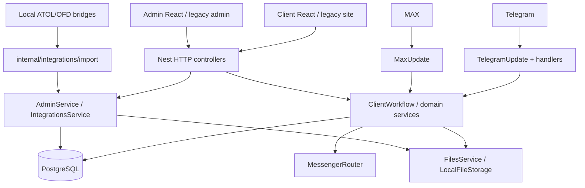

# Current backend architecture

## As-is

`CODE_CONFIRMED`: entry point `src/main.ts`; bootstrap/security/Swagger в `src/app.bootstrap.ts`; composition root в `src/app.module.ts`. TypeORM использует PostgreSQL, `synchronize=false`, migrations не запускаются приложением автоматически.

## Cross-cutting runtime

- Global `ValidationPipe`, `ApiErrorFilter`, request ID middleware и in-memory `RateLimitGuard`.
- Helmet включён, CSP отключён; CORS создаётся только при заданном allowlist.
- Admin использует hashed server sessions, same-origin mutation guard и permission guard.
- Client web session является анонимной possession-сессией, cookie `HttpOnly`, `SameSite=Lax`, `Secure` в production.
- Swagger v0.2.0 размечен в основном только tags; production по умолчанию отключён, при включении требует admin session.
- `/health/live` проверяет процесс; `/health/ready` проверяет БД и только наличие migration `SecurityFoundation1785079000000`, не актуальность последней migration, storage, polling или bridges.

## Module map

| Модуль | Реальная ответственность и consumers | Состояние | Решение |
|---|---|---|---|
| `UsersModule` | channel user, channel mirror, legacy `talkingTo`; bots/web/workflows | `INCONSISTENT` | `MIGRATE_GRADUALLY` к canonical customer, не ломая channel lookup |
| `WebSessionModule` | анонимная web identity и cookie session | `TEST_CONFIRMED` | `KEEP`, позже добавить controlled linking |
| `AdminModule` | auth/RBAC, очереди, customer card, большинство admin use cases | `TEST_CONFIRMED`, границы широкие | `HARDEN`; постепенно выносить domain commands из giant controller/service |
| `OrganizationsModule` | реквизиты и membership | `PARTIAL` | `HARDEN` verification/claim flow |
| `AssetsModule` | ККТ, ФН, ОФД | `PARTIAL` | `KEEP`; добавить location/FK/linkage вертикально |
| `RegistrationsModule` | пошаговая анкета, фото, PDF, уведомление | `PARTIAL` | `CONSOLIDATE` web/bot contract |
| `ServiceRequestsModule` | service catalog, forms, state, files, ATOL consent, delivery | `PARTIAL` | `CONSOLIDATE` в стабильный aggregate/application API |
| `TicketsModule` | один открытый вопрос и message history | `PARTIAL` | `MIGRATE_GRADUALLY`; не переименовывать в universal conversation без use case |
| `ClientModule` | channel-neutral facade для части bot/web flows | `PARTIAL` | `KEEP`, уменьшать обход facade отдельными controllers |
| `FilesModule` | content validation, metadata и local storage port | `TEST_CONFIRMED` | `KEEP/HARDEN` retention и centralized authorization |
| `AuditModule` | security/administrative event log | `PARTIAL` coverage | `KEEP/HARDEN` для business mutations |
| `CustomerActivityModule` | денормализованная клиентская лента | `PARTIAL` | `DEPRECATE` после появления надёжных domain histories/read model |
| `IntegrationsModule` | imports, mappings, observations, opportunities, bridge control | `PARTIAL` | `KEEP` изолированным adapter boundary |
| `DatabaseSeedModule` | runtime seed registration fields | `LEGACY` | `MIGRATE_GRADUALLY` к versioned definitions/migrations |
| `SiteModule` / embedded pages | fallback static UI | `LEGACY` | `REMOVE_AFTER_PROOF` React production serving |

## Boundaries and hotspots

- `ServiceRequestsService` (938), `IntegrationsService` (1110), `AdminService` (688), `AdminController` (897), `TelegramUpdate` (915), `MaxUpdate` (836) являются giant files. Риск локальных изменений высокий; characterization tests есть только для части веток.
- Transport controllers используют application/domain services, но `AdminService` напрямую агрегирует много repositories. Это допустимо для текущего монолита, однако затрудняет единые invariants.
- `ClientWorkflowService` является полезным channel-neutral фасадом, но `ServiceRequestsController` вызывает `ServiceRequestsService` напрямую; web и bots поэтому легко расходятся.
- `forwardRef` и явные циклические DI зависимости не найдены. Scheduler/jobs module отсутствует.
- Две UI-реализации (React и legacy HTML) сохраняют риск несовместимого поведения. Production policy уже предпочитает React и запрещает legacy.

## Minimal target

Сохраняется модульный монолит NestJS и общие PostgreSQL/FileStorage. Целевые границы: Identity & Customer; Staff Access; Organizations & Locations; Equipment; KKT Registration; Service Requests & Forms; Conversations; Catalog; Orders; Files; Audit; Notifications; Integration Adapters.

Не следует объединять `Ticket` и `ServiceRequest` немедленно: вопрос является conversation use case, заявка является операционным workflow. Их нужно связать, а не превращать в один универсальный объект. Integrations должны продолжать отдавать normalized observations/opportunities, не владеть customer workflows.

Expand/migrate/contract необходим для identity, domain FK, registration contract и service request schema. Локального hardening достаточно для readiness, rate limiting, delivery diagnostics и file retention до появления доказанной потребности в отдельной инфраструктуре.
