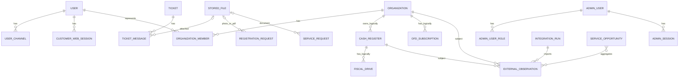

# Domain model and data audit

## ER view

Сплошная семантика диаграммы не означает FK. Фактические FK перечислены ниже.

## Identity

- `UserEntity` уникален по `(platform, chatId)` и потому channel-scoped.
- `UserChannelEntity` имеет FK на user и unique `(platform, externalId)`, но `UsersService.getOrCreateOrUpdate` создаёт отдельного user для каждого канала и привязывает к нему канал. Canonical multi-channel profile отсутствует.
- `CustomerWebSessionEntity` имеет FK на user и хранит hash token/expiry/revocation. Телефон и email не являются verified identity.
- Legacy `isAdmin`, `isOperator`, `talkingTo`, notification flags находятся на customer user. Admin identity и RBAC отдельно в `admin_users`, `admin_user_roles`, `admin_sessions`.
- Backend v1 может отложить SMS OTP и полное объединение каналов, если ownership остаётся session/channel scoped и появляется явный безопасный link flow позднее.

## Organizations

- `OrganizationEntity` unique `(inn,kpp)`; при пустом КПП service дополнительно ищет любую организацию по ИНН.
- `OrganizationMemberEntity` имеет FK к organization/user и роли owner/manager/accountant/employee.
- `OrganizationsService.linkUserByInn` создаёт или реактивирует membership сразу как `active`, default role `owner`, `confirmedAt=now`. `isVerified` организации при этом не проверяется.
- `BUSINESS_DECISION_REQUIRED`: до client cabinet нужен claim/approval policy. В текущем виде любой web-session, знающий ИНН, может получить доступ к данным организации и добавлять equipment.
- `RESOLVED_AFTER_AUDIT (BKV1-0)`: создан отдельный `OrganizationAccessRequest` со статусами pending/approved/rejected/cancelled. Active membership появляется только после ручного approve и получает роль `representative`; legacy memberships сохранены без автоматического backfill.
- Location/trading point отсутствует (`MISSING`). Адрес есть строками в organization, cash register и service request visit, но это не canonical location.

## Equipment

- `CashRegister`, `FiscalDrive`, `OfdSubscription`, `EquipmentKit` покрывают ККТ-направление. Общего Equipment aggregate нет.
- В initial migration organization/cash-register links у этих таблиц numeric-only; FK отсутствуют. Integration entities добавлены позже уже с явными FK.
- `EquipmentKit.registrationRequestId` и `RegistrationRequest.equipmentKitId` являются параллельными numeric links без FK/единственного владельца.
- Историческое состояние ограничено датами и external observations. У ФН нет status, у ОФД status есть; firmware/check counters как canonical fields отсутствуют.
- Для Backend v1 нужны location, проверяемые FK и nullable equipment link в request. Универсальный inventory, напоминания и не-ККТ equipment можно отложить.

## KKT registration

- `RegistrationRequestEntity` смешивает fixed typed columns, workflow flags (`isFilled`, `isStopped`, `isProcessed`), status и legacy paths.
- `RegistrationFieldEntity` хранит name/label/step, но не version/schema/validation.
- Фото и PDF имеют StoredFile FK, при этом legacy path/name/link поля сохраняются для совместимости.
- `RegistrationsService.fillRegistration` пропускает `equipmentPhoto` и переводит `currentStep` за последний шаг. Поэтому web form может завершить анкету без обязательного bot-фото (`INCONSISTENT`).
- `getNotFilledReg` ищет `isFilled=false`, но не исключает `isStopped`; model flags допускают конфликтующие комбинации.
- Canonical contract: versioned registration form, одинаковые required fields для каналов, draft/resume/cancel/submit, required equipment evidence, generated PDF/document links и одна state model.

## Service requests

Фактический aggregate содержит type snapshot, channel identity, optional numeric user/organization, status/currentStep, answers JSONB, price, invoice/payment/ATOL files, visit, operator text IDs, engineer FK, priority and timestamps.

Разрывы относительно канонического контракта:

| Поле | Состояние |
|---|---|
| source/channel | `CODE_CONFIRMED`: `platform/chatId`, но source semantics не отделена |
| customer/contact | `PARTIAL`: userId + answer fields, без verified contact snapshot |
| organization | `PARTIAL`: numeric ID без FK |
| location/equipment | `MISSING` |
| service type | `PARTIAL`: ID без FK + code/title snapshot |
| form/version | `MISSING`: только hardcoded `simple`/`fn_replacement` |
| structured answers | `CODE_CONFIRMED`: JSONB, но schema/validation version отсутствует |
| description/attachments | `PARTIAL`: description внутри answer; только специальные file columns |
| internal/customer status | `INCONSISTENT`: один status обслуживает обе аудитории |
| operator/engineer | `PARTIAL`: operator string, engineer FK |
| events | `PARTIAL`: numeric request ID без FK; не все изменения atomic |
| messages/result | `MISSING` |
| documents | `PARTIAL`: invoice/payment/consent typed columns |

ATOL consent реализован как скрытый custom service type внутри того же aggregate. Это разумная reuse-модель, но custom branching подтверждает предел текущего двух-flow DSL.

## Tickets and activity

- `Ticket` является отдельным открытым вопросом (`isAnswered`), не общей Conversation. `TicketMessage` имеет FK на ticket и optional StoredFile.
- Один active ticket определяется запросом, но DB unique constraint на active ticket отсутствует; concurrent opens могут создать два.
- `CustomerActivity` дублирует часть событий ticket/service request и использует numeric links без FK. Регистрации покрываются непоследовательно.
- `ServiceRequestEvent` и `AuditEvent` имеют разные цели: domain history и security audit. Объединять их не следует; нужно определить coverage и FK.

## Catalog and orders

`MISSING`: entities, migrations, repositories и API для Category/Product/Brand/Image/Attribute/Price/Availability/Publication/Order/OrderItem/status history не найдены. Frontend catalog и cart не являются persisted domain data.

Минимальный catalog Backend v1: category, product, publication state, image link, display attributes, price and coarse availability, optional external mapping. Это витрина, не склад 1С.

Минимальный order-request: order, immutable contact snapshot, order items with name/price/quantity snapshots, status history, manager assignment, comment/documents, unguessable access bound to session/token, idempotency key. Direct 1C integration можно отложить.

## Integrity priorities

1. Add explicit FKs/relations for request/user/organization/type/event and registration/equipment links using expand/backfill/validate/contract.
2. Introduce versioned form reference before changing existing answer keys.
3. Replace conflicting registration flags with enforced transitions only after characterization/backfill.
4. Add optimistic version or guarded conditional updates to mutable workflows.
5. Keep JSONB for provider metadata and versioned answers; do not use it as an unchecked substitute for ownership or core relations.
