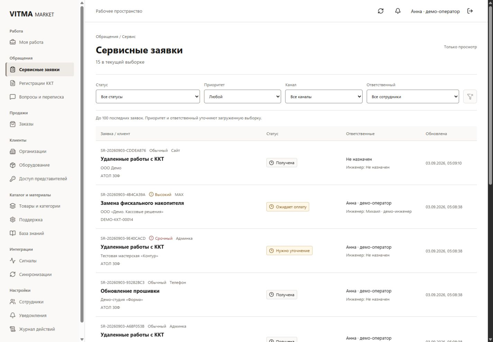
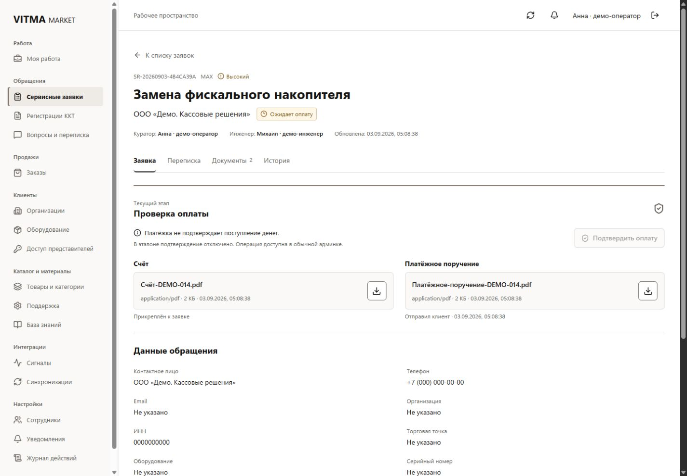
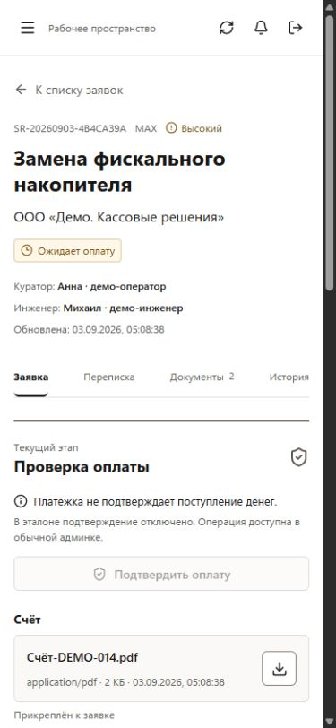
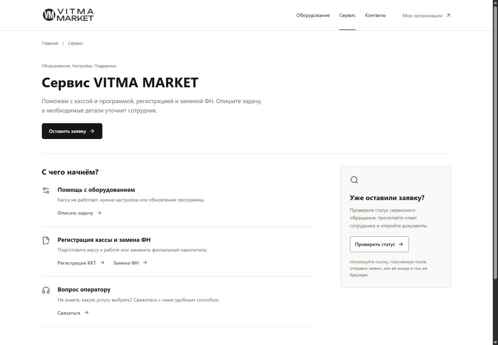
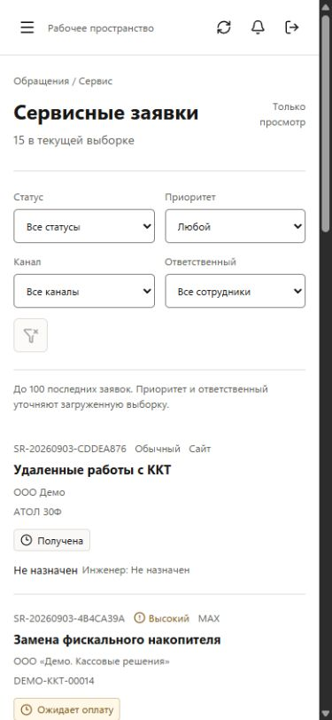

# FE-1A Service reference review

Draft for visual approval, 2026-09-03. **Not a production redesign.**
Baseline: `4de78fe5696d781341272328305041236ebece99` (PSR-1),
[green baseline CI](https://github.com/cltvv1/market-bot/actions/runs/33614871297).
Branch: `codex/fe-1a-interface-foundation-reference-slice`.
Dedicated worktree: `C:\CODING\learn-bot-fe1a`.
The original worktree and its dirty lockfile were not changed.

Read alongside [interface architecture and API matrix](2026-09-03-interface-architecture.md)
and [design foundation](2026-09-03-design-foundation.md).
Canonical PSR-1 status, grades and roadmap are unchanged.

## Preview

The current local preview uses synthetic data, with bots and delivery disabled.

- Queue: <http://localhost:5173/admin/reference/service-requests>
- Payment detail: <http://localhost:5173/admin/reference/service-requests/14>
- Client service: <http://localhost:5174/site/reference/service>
- Existing admin login: <http://localhost:5173/admin/>
- Existing client: <http://localhost:5174/site/>

Synthetic login `fe1a-review`, password `Reference-Only-2026!`.
Other fixture logins, same synthetic password: `fe1a-engineer` (one assigned
request), `fe1a-empty` (no assignments), `fe1a-sales` (no service permission),
`fe1a-operator`. These credentials belong only to the disposable local DB.
Do not provision them in a deployment or shared environment.

### Reproduce from an empty isolated environment

PowerShell, Node version from `.nvmrc`, Docker running. Execute in the dedicated
worktree, not the user's original checkout. Ports 3000, 5173, 5174 and 55436 must
be free. Do not kill unrelated processes to free them.

```powershell
Set-Location C:\CODING\learn-bot-fe1a
npm ci
docker run --name vitma-fe1a-postgres -e POSTGRES_USER=vitma_fe1a -e POSTGRES_PASSWORD=fe1a_local_test_only -e POSTGRES_DB=vitma_fe1a_application -p 127.0.0.1:55436:5432 -d postgres:16
docker exec vitma-fe1a-postgres pg_isready -U vitma_fe1a -d vitma_fe1a_application
. ./admin-ui/src/reference/tools/offline-env.ps1
npm run ci:build
npm run ci:database
npm run ci:offline-smoke
npm run db:test:reset
npm run migration:test:run
node -r ts-node/register admin-ui/src/reference/tools/seed-reference.cjs
node dist/src/main.js
```

Wait for `pg_isready` to report readiness before database commands. If the
dedicated container already exists, use `docker start vitma-fe1a-postgres`
instead of creating another. `db:test:reset` destroys **only this disposable
test database**; never run it against a populated environment you want to keep.
Run full database tests before seeding: they reset the test DB as well.
On an already prepared preview, omit reset/migrations/seeding and just start API.

Second terminal:

```powershell
Set-Location C:\CODING\learn-bot-fe1a
npm run start:admin -- --host 127.0.0.1 --port 5173 --strictPort
```

Third terminal:

```powershell
Set-Location C:\CODING\learn-bot-fe1a
npm run start:site -- --host 127.0.0.1 --port 5174 --strictPort
```

The environment helper is a committed, deterministic **synthetic test setup**,
not a copy of a local `.env`. It selects test DB `vitma_fe1a_test` on loopback
55436 and FileStorage under the OS temporary directory (`vitma-fe1a-storage`).
Polling and outbound worker are false, Telegram token is fake, MAX and bridge
key are empty. No provider sync is invoked. The user's `vitma_postgres` container
on 5432 is untouched. Seeder assertions reject the wrong DB/host/port/root.

## Screenshots

All images show synthetic objects from the real API. No real customers,
documents, credentials or local paths appear in the images. Captured browser
content at the requested viewport, without cropping away the layout. The address
bar is not part of these captures; exact direct URLs are listed above.
The in-app capture surface outputs 1425 x 990 pixels for the verified
1440 x 1000 viewport and 375 x 812 for 390 x 844. These are the tool's native
captures, not manually cropped or resized images. JPEG capture bytes were
converted to actual PNG files without changing their dimensions or content.

### Admin queue, 1440 x 1000



### Admin detail, 1440 x 1000



### Admin detail, 390 x 844



### Client service, 1440 x 1000



### Client service, 390 x 844


### Admin queue, 390 x 844



## Implemented surface

Admin shell has a 248px permission-filtered sidebar, employee identity, refresh,
read-only existing notification preferences and real logout. Unimplemented
navigation entries are unavailable, not fake workspaces. The sidebar groups
My work, Requests, Sales, Customers, Catalog/materials, Integrations and Settings.

Queue uses real status/platform filtering, local priority/responsible filtering
of the authorized capped result, URL pagination and one detail link per row.
The cap (100) is explicit. No invented full total, search, sort or SLA. Row focus
is restored by the explicit back link, including filters/page/selection.

Detail has its own URL and four tabs: Request, Conversation, Documents, History.
The Request tab begins with the stage/next-action area, followed by actual
fields and answers. On mobile the tabs precede the stage, so tabs and the
confirmation area both fit in the initial viewport. Invoice and proof are
matched by current file ID **and** attachment kind, not by filename or message.
Payment confirmation is disabled with explanation; no business command is
sent and there is no local success simulation. It never equates a proof with
money received. Download URLs are the current protected attachment routes.

Client page uses the existing logo, one main request CTA, compact service paths
(equipment, registration/FN, contact) and a distinct existing-request path.
All paths open existing product routes. Contact opens Contacts, not an invented
chat. Current-browser status access is described without a cross-device promise.
No new frontend app, package, store, commerce, form engine or login is introduced.

### Components and contracts

| Source | Responsibility |
| --- | --- |
| `ReferenceAdminApp`, `Navigation`, `Workspace` | Session, permissions, shell, native mobile dialog, URL routes |
| `ServiceQueueReference` | Real queue, query state, bounded client filtering and pagination |
| `ServiceDetailReference`, `PaymentStage`, `Fields` | Real detail, stage evidence, tabs, definition lists |
| `ReadState`, `StatusIndicator`, `PriorityIndicator`, `DocumentRow` | Small used primitives, accessible state text and protected links |
| `useRead` | Existing API helper with AbortController, retry, no previous-object flash |
| `service-reference-model`, `navigation` | Presentation/URL contracts, permission-filtered navigation, not business rules |
| `ReferenceClientApp` | Public service page and mobile disclosure |
| `foundation.css`, two scoped reference stylesheets | Shared semantics, separate admin/client density |

| Real read API | Existing DTO / use |
| --- | --- |
| GET `/admin/api/me` | `Admin`, permissions and own display name |
| GET `/admin/api/service-requests?status=...&platform=...` | `ServiceRequest[]`, max 100 rows; server all/assigned enforcement |
| GET `/admin/api/service-requests/:id` | Request, `ServiceMessage[]`, `ServiceAttachment[]`, `ServiceEvent[]`, delivery events |
| GET `/admin/api/staff/engineers` | `Staff[]`, only with `staff.read`; other identities remain explicit IDs |
| GET `/admin/api/service-requests/:id/attachments/:attachmentId` | Protected FileStorage download, existing ownership/assignment checks |
| GET `/admin/api/notification-bindings` | Existing `NotificationSettings`, no preferences mutation |
| POST `/admin/api/logout` | Existing auth action only, no domain mutation |

`ReferenceRequest` adds TypeScript declarations for **already returned**
`updatedAt`, `visitAddress`, `visitTime`, not new backend fields. Existing api.ts,
types.ts and format.ts are reused and unmodified. No direct table queries from UI.
No `referenceFixture` response replaces the API. Seeder calls existing domain
methods for 14 requests and two synthetic PDF files; normal site smoke later
adds another real test request. The demo MAX request remains unsent because
polling/delivery are disabled.

## Isolation and bundle result

Both main entrypoints lazily dispatch only when `import.meta.env.DEV` **and**
`import.meta.env.REFERENCE_DEV_SERVER` are true and the route is a reference
route. Vite defines the latter from `command === 'serve'`. The extra compile-time
gate matters: this repository's CI uses `NODE_ENV=test`, where DEV alone can be
true even during a build. The command gate removes reference code in that case too.

Normal navigation has no reference links. Existing App components and legacy
CSS are not changed. New CSS is scoped to `.ui-reference-root`; the shared file
is not a new dependency/package. Production output contains no reference route
dispatch, modules or selectors, including `NODE_ENV=test` builds.

Like any SPA fallback, a production server may return the normal app for an
unknown URL; it never renders this reference. No new backend serving flag exists.

`compare-build.mjs` builds the baseline entrypoints in memory with the same
toolchain and compares normal JS/CSS output:

| Bundle | Baseline bytes | FE-1A bytes | Delta |
| --- | ---: | ---: | ---: |
| admin.css | 12,555 | 12,555 | 0, byte-identical |
| admin.js | 520,338 | 520,341 | +3 |
| site.css | 64,432 | 64,432 | 0, byte-identical |
| site.js | 745,730 | 745,733 | +3 |

No new production chunk; existing large-chunk warnings remain. This is not a
code-splitting package. Rollback consists of removing the reference directories,
entrypoint/config gates and the optional reference CI step, not reverting domains.

## Visual and accessibility verification

White surfaces dominate. Graphite `#171615`, muted `#625d58`, restrained warm
accent `#80766d`/`#5f5650`; all status tokens are documented in the foundation.
No green tokens/aliases in new source. Computed foreground/background/border
colors checked in both reference UIs, including completed status, no green.
System font only: admin 14px, client 16px, no viewport-scaled type. Radius 6px,
no decorative shadows/gradients or nested cards. Document rows are distinct
objects, not page sections styled as floating cards.

| Viewport | Queue | Detail | Client service |
| --- | --- | --- | --- |
| 1440 x 1000 | Sidebar, table | Adjacent files, tabs/action | Public navigation, paths/status |
| 1280 x 800 | No overflow | No overflow | No overflow |
| 768 x 1024 | Drawer, readable table | Stacked responsive area | No overflow |
| 390 x 844 | Stacked object list | Wrapped heading, tabs and action visible | Disclosure, service paths |

No horizontal page overflow on all four sizes. Long synthetic organization
names and the FN replacement title wrap without overlapping. Browser checks:

- Direct queue/detail routes, successive filters and reload, page 2 reload,
  browser Back/Forward and explicit back with selected-row focus passed.
- Detail tabs update URL; ArrowLeft/Right and Home/End move the roving focus;
  actual message/document/history data renders.
- Queue and detail loading inspected while temporarily pausing **only** the
  disposable DB; unpaused in finally. Shell/filters remain, state has `role=status`.
- Populated, filtered empty, engineer with no assignments, completed and urgent
  states inspected. Engineer sees only assigned request; sales has no service
  navigation or fetch. Unassigned detail is denied by existing backend (400),
  displayed as unavailable rather than a connection failure.
- Recoverable error inspected by stopping only the preview API; refresh after
  restart restores the list. No raw error messages in UI.
- Logout in another tab followed by refresh yields real 401, hides request data,
  offers normal login and restores access after reauthentication.
- Native admin drawer opens with Enter, closes with Escape, returns focus and
  locks background scroll. Client disclosure closes with Escape and returns focus.
- Client request, equipment, FN, registration, status and contact links clicked;
  existing routes render, browser Back/Forward works, no fake submission.
- Clean reference navigation: no console warnings/errors or unhandled promises.
  Deliberate denied/offline/expired tests naturally produce failed HTTP responses;
  those are expected negative-test output, not a zero-network-error claim.
- Text contrast >=4.5:1 and control/focus >=3:1 against reference surfaces are
  enforced by an automated token test. Decorative dividers and disabled controls
  are not used as the sole accessible signal. Focus outlines, landmarks, field
  labels, current navigation and textual statuses were inspected. No animation
  is required; reduced motion is respected. No full screen-reader audit claimed.

## Verification results

Run these in the isolated environment described above. Database checks run
before seeding; they must not reset a preview while someone is using it.

```powershell
. ./admin-ui/src/reference/tools/offline-env.ps1
npm run lint:site
npm run ci:quality
npm run ci:database
npm run ci:build
npm run ci:offline-smoke
npx tsc --noEmit -p admin-ui/tsconfig.json
node admin-ui/src/reference/tools/reference-model.test.cjs
node admin-ui/src/reference/tools/compare-build.mjs
```

With the isolated API running: `npm run test:site`.

| Check | Local result |
| --- | --- |
| `npm ci` | PASS; no dependency or lockfile edits |
| `lint:site`, admin TypeScript | PASS |
| `ci:quality` | PASS, 32 suites / 224 tests |
| Lint ratchet | PASS, no added violations; existing debt 763 errors / 9 warnings in 66 files |
| `ci:database` | PASS, 20 suites / 196 integration tests; 2 suites / 7 e2e tests; 11 migrations, idempotent, no drift |
| `ci:build` | PASS, admin/client/Nest; existing chunk-size warnings only |
| `ci:offline-smoke` | PASS, built normal site/nested routes/admin login+logout/health |
| `test:site` | PASS, normal callback/search/solutions/catalog/cart/service submission/registration/mobile flows |
| Reference contract tests | PASS, 12 tests: query, filters, permissions/nav, current proof, names, build isolation, error states, contrast |
| Browser verification | PASS within the explicit scope above |

Normal admin login and existing tabs (service, registrations, questions, signals,
access, organizations, kits, staff, audit) were opened. This is a navigation/render
regression check, not a new claim of exhaustive legacy mutation coverage. Normal
client workflows are exercised by existing site smoke. Production CSS is identical.
CI adds only a frontend check step to the existing build job, with no backend test
or lint baseline edits. Exact-head hosted results are linked from the draft PR;
the final task report records the run and all required jobs after they finish.

## Gaps and next stages

The full evidence/classification matrix is in the architecture document.

- **Before complete web payment:** P-PROOF. Generic ServiceRequest message upload
  does not set canonical paymentProofFileId; never show it as confirmed proof.
- **Before production commands in FE-1B:** resolve authoritative allowed actions,
  reasons/version checks through a bounded contract or reviewed command-specific
  behavior. Existing backend remains the authority. Reference has no mutations.
- **Production rollout gates retained from PSR-1:** registration auth ordering,
  bearer lifecycle and other documented SEC work are not fixed by new screens.
- **Non-blocking for this read slice:** capped queue, incomplete staff name
  projection, missing file lifecycle/downloadability, assignment error code 400.
  Keep honest limitations or address them in bounded B-R1.
- **Separate later client packages:** registration discovery/resume (R-RESUME),
  verified identity (IDENTITY-1), complete My work/customer read views (B-R2).

If visually accepted: FE-1B Admin shell and ServiceRequest production migration,
then FE-1C Client service production migration. Add real versioned commands,
preserve RBAC and add browser workflow tests; remove reference-only duplication.
If rejected: revise this draft branch only. Neither package is started here.

## Decisions requiring approval

Approval has **not** been received. Please review:

1. Sidebar width (248px), density and grouping of separate domains.
2. Queue row density, visible identity/status/assignment hierarchy.
3. Four detail tabs and keeping documents separate from conversation.
4. Next action at the top of Request content, tabs before it on mobile.
5. Restrained warm accent intensity against mostly white/graphite surfaces.
6. Client service hierarchy: one main CTA, three paths, existing-request area.
7. Mobile admin modal drawer versus lighter public navigation disclosure.

## Exact changed file inventory

Normal entry/config and CI only:

```text
.github/workflows/ci.yml
admin-ui/src/main.tsx
admin-ui/src/vite-env.d.ts
admin-ui/vite.config.ts
client-ui/src/main.tsx
client-ui/vite.config.ts
```

Isolated implementation and reproducible verification:

```text
admin-ui/src/reference/ReferenceAdminApp.tsx
admin-ui/src/reference/navigation.ts
admin-ui/src/reference/primitives.tsx
admin-ui/src/reference/reference-admin.css
admin-ui/src/reference/use-read.ts
admin-ui/src/reference/service/ServiceQueueReference.tsx
admin-ui/src/reference/service/ServiceDetailReference.tsx
admin-ui/src/reference/service/service-reference-model.ts
admin-ui/src/reference/tools/compare-build.mjs
admin-ui/src/reference/tools/offline-env.ps1
admin-ui/src/reference/tools/reference-model.test.cjs
admin-ui/src/reference/tools/seed-reference.cjs
client-ui/src/reference/ReferenceClientApp.tsx
client-ui/src/reference/foundation.css
client-ui/src/reference/reference-client.css
```

Documentation and generated synthetic screenshots:

```text
docs/frontend/2026-09-03-interface-architecture.md
docs/frontend/2026-09-03-design-foundation.md
docs/frontend/2026-09-03-service-reference-slice.md
docs/frontend/screenshots/2026-09-03/admin-service-queue-desktop.png
docs/frontend/screenshots/2026-09-03/admin-service-detail-desktop.png
docs/frontend/screenshots/2026-09-03/admin-service-detail-mobile.png
docs/frontend/screenshots/2026-09-03/admin-service-queue-mobile.png
docs/frontend/screenshots/2026-09-03/client-service-desktop.png
docs/frontend/screenshots/2026-09-03/client-service-mobile.png
```

No changes under backend `src/**`, `test/**`, migrations or integration scripts.
No dependencies/lockfiles/schema/permissions changed. No production data,
provider calls, EM-0, FE-1B, Catalog/Orders production UI, 1C, EDO or new
notifications subsystem. No GitHub Issues, deployment or merge. PR stays draft.
