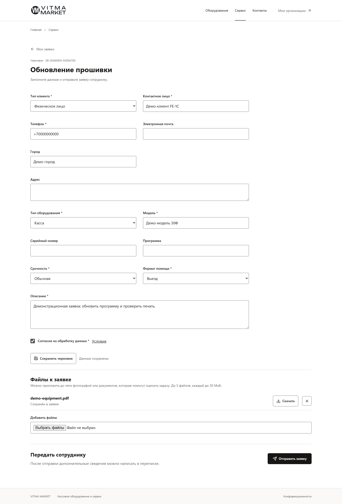
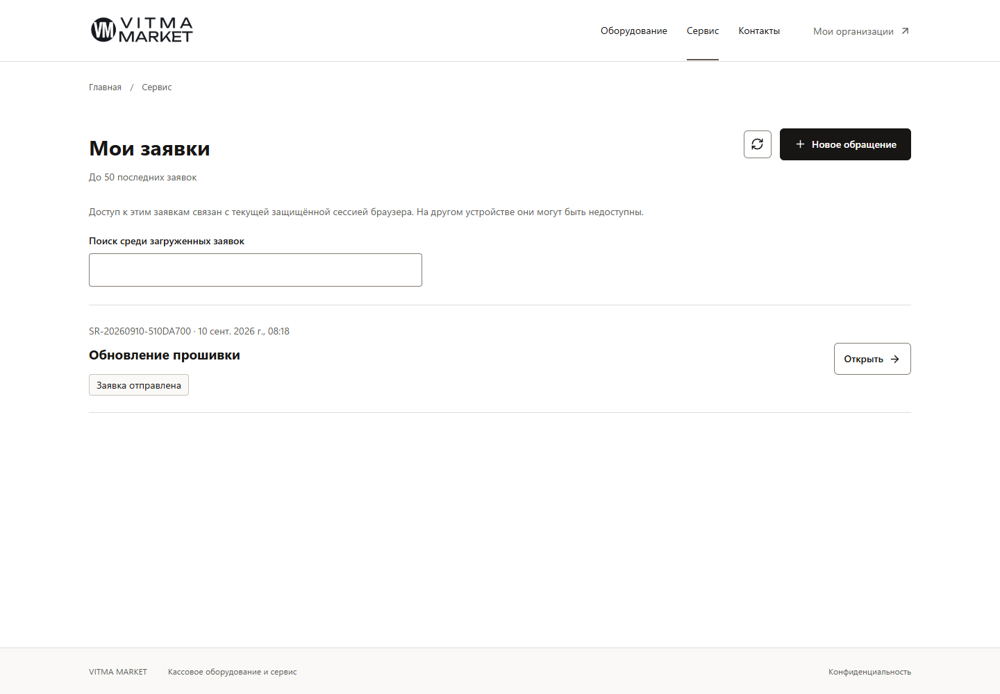
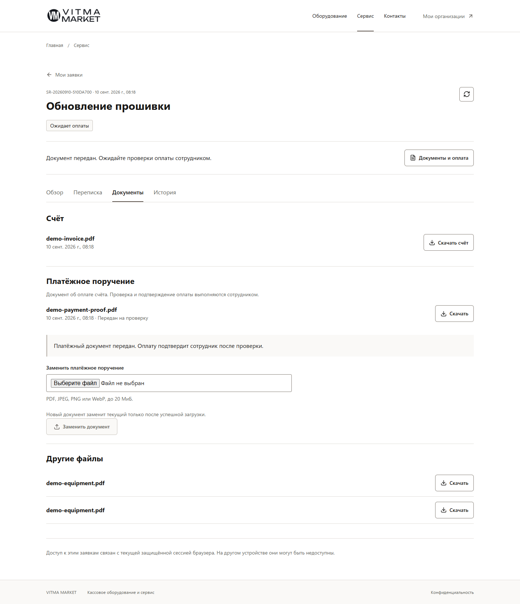

# FE-1C Client service production migration

Implementation branch report, not a merged-main or public-rollout claim.

## Baseline and scope

Exact baseline: `17e99d85ea26a6fab2a299905641c45683f994a3`, PR #28 merge.
[Baseline CI](https://github.com/cltvv1/market-bot/actions/runs/34444097649): success.
Branch: `codex/fe-1c-client-service-production`. Separate worktree `learn-bot-fe1c`.
The original dirty worktree and its lockfile are not modified.

Production ServiceRequest only: landing, real types, drafts, owner list/detail,
conversation, documents, canonical P-PROOF and limited legacy links. No Orders,
Catalog, Support, registrations, account/login/linking, EM-0, schema or dependencies.

## Implementation map (baseline inventory)

| Production route | API | Ownership | Response/command | Verified gap |
|---|---|---|---|---|
| `/site/service` | None on landing | Public | Existing approved paths | Reference-only design; global session auto-creation |
| `/site/service/request` | Session; types; POST drafts | Explicit new-flow session | Published schema; contacts; real draft ID | Three hardcoded forms; monolithic create/upload/submit |
| `/site/service/requests` | GET client/service-requests | Current cookie owner | Up to 50 summaries, including pristine drafts | No dedicated list; status collapse |
| `/site/service/requests/:id/edit` | GET detail; PATCH draft; attachments; submit | Exact owner | Pinned form, answers, snapshots, expectedVersion | No resume URL; snapshots not updated; missing origin guards |
| `/site/service/requests/:id` | GET detail; messages; attachment download | Exact owner | Stage, conversation, invoice, safe events | Separately read proof version; raw message identity; no curated history |
| Detail documents | POST/GET payment-proof | Exact owner only | Existing P-PROOF workflow/version | Backend complete, UI not connected |
| `/site/service/status` | Owner lookup by number OR explicit public-token API | Separate transports | Legacy status/reply only | Catch-all owner-to-public fallback and token storage |

Current general web handlers: `simple` and `fn_replacement`. Default types are
`kkt_remote_work`, `firmware_update`, `fn_replacement`; additional published types
are supported only in these handler families and supported field schemas.
`atol_consent` is specialized and must not use generic submit. KKT registration
continues through its existing separate page. No prices are inferred from query context.

## Supporting backend changes

- Owner-only read builder: one authorized REPEATABLE READ snapshot, pinned form,
  filtered answers, safe author labels, allowlisted events and current invoice.
- Reuse the P-PROOF binding/projection builder with that same row/manager.
- Versioned draft PATCH locks row; synchronizes form/contact context and records
  Event/Audit transactionally; no-op does not create a new version/event.
- Optional bounded snapshots cannot change linked organization/equipment identity.
- Origin guards on the connected owner mutations; existing pre-Multer guards kept.
- File policies and pinned attachment count remain server-authoritative.

Each addition addresses a baseline gap: resume needs the pinned schema; contact
edits must reach staff snapshots; version/payment capabilities must come from one
authorized row; cookie mutations need origin validation. No new endpoint, entity,
migration, permission or identity. Owner projections expose whitelisted snapshot
fields, not TypeORM entities, staff IDs, provider URLs or arbitrary file metadata.
Foreign/missing IDs return the same 404 before dependent reads; IDs are bounded
to PostgreSQL int. Private reads/downloads use no-store. Downloads preserve
disposition, length and nosniff. P-PROOF command/channel semantics are unchanged.

## Routes and session

One BrowserRouter, basename `/site`, contains all routes in the implementation
map. Scoped service Layout promotes the FE-1A header/footer and visual language;
other pages keep their existing Layout/session boundary. Shared foundation is
unchanged. The old client reference runtime is removed; `/reference/service`
redirects to `/service`. Query context is bounded text for a new description,
never identity/price/permission or an overwrite of an existing draft.

Landing creates no session/draft. Existing data first requires GET session. A 401
removes private components and clears bootstrap state, without POST, token
fallback or mutation retry. Only an explicit new-request action may bootstrap;
concurrent callers, including one arriving during POST, share one promise.
Network failure is not interpreted as a missing cookie. No fake customer login,
destructive logout button, cross-device recovery or messenger profile linking.

Owner transport includes cookies; public transport explicitly omits them. Legacy
number-only links search the owner's latest 50 summaries. Explicit bearer links
retain limited status/reply access, never owner controls or proof access. No new
bearer tokens, answers, documents, contacts or statuses are written to storage.

## Forms, drafts and concurrency

All 14 existing field types are rendered with labels, conditions, options and
limits from the server. Conditions use strict equality; no eval/HTML. Consent is
not preselected. Backend validation remains authoritative. Unsupported specialized
forms fail closed. Retired V1 remains pinned after V2 publication. Private fields,
dependent fields and their answers are excluded from owner responses.

Explicit create returns `created`; an existing draft gets a continue choice,
without replacing answers/contacts or uploading files. PATCH locks the exact
owner's draft and derives normalized answers/contact/location/manual snapshots
together. Contradictory input and linked-identity setters are rejected. Changed
input requires expectedVersion and one version/Event/Audit transaction. Equal
input is a no-op. Type/form/user/organization/equipment identity cannot be reset.

Save, upload/remove and submit are separate actions. Local editing baseline and
fresh server version remain separate. 409 shows a comparison and explicit choice,
not a silent merge. Failed/unknown selected uploads block submit until resolved;
successful files remain. Unsaved full-page unload warns. One cryptographic UUID
per draft submit attempt lives in sessionStorage as retry metadata only.
Double-click is locked. Lost submit reads the same ID; reload does not resubmit.

## Detail and documents

List says **up to 50 latest** and searches only loaded summaries, including pristine
drafts. Detail tabs use URL query state. Actual stages distinguish waiting_payment,
paid, scheduled, in_progress and completed. Only stored visit/completion facts
are shown; no invented SLA. History allowlists business events with safe labels,
not messages, internal notes, delivery metadata or arbitrary payloads.

Conversation sends text/file separately. Successful text is cleared before a
failed file upload; retry sends only the remaining file. Refresh failure after a
successful command does not resend it. Refresh and tab changes preserve local
text/File. Late reads are aborted/ignored on route changes. No background polling.
Unknown append/upload result requires explicit inspection, not automatic replay.

Invoice comes from the canonical pointer and matching kind, not the latest PDF.
Unavailable documents have a safe state. Dedicated P-PROOF accepts PDF/JPEG/PNG/
WebP up to 20 MiB with existing server content validation. Selection captures
expectedVersion. 409/lost response retains File and reads the current binding;
replacement needs explicit review. Confirmed upload clears input before refresh.
Ordinary PDFs never become proof. Upload leaves waiting_payment; only staff
confirms actual money. Paid disables replacement but preserves protected download.
There is still no public proof metadata/upload/download.

## Verification

Required local checks: npm ci; lint:site; both frontend typechecks; ci:quality;
ci:database; ci:build; ci:offline-smoke; test:site; both migration:show and both
schema:log. All use isolated synthetic resources with providers disabled.

| Layer | Result |
|---|---|
| Unit | 288 tests / 38 suites (5 new owner-contract tests) |
| Integration | 273 tests / 22 suites (3 new owner/context/origin/privacy cases) |
| E2E | 7 tests / 2 suites |
| Frontend contracts | 9 admin + 15 client |
| Browser acceptance | 28 existing admin + 29 client checks |
| Schema | 11 applied migrations; 0 pending; 0 drift in application/test DBs |
| Lint ratchet | No additions; existing debt 692 errors / 6 warnings / 64 files |

Client contracts and the client/operator browser workflow are CI-wired. One
historical FE-1B assertion changes from reference-only to production client routes;
no admin runtime changes. Staff transitions use the existing UI, not SQL status
edits. Separate customer, employee and public/foreign browser cookie jars.

Coverage: real create/save/upload/reload/resume; pinned schema/privacy; two-editor
409; double-click/lost submit; internal notes excluded; text/file partial success
and refresh failure; invoice download; proof/manual payment; stale proof/lost
response; public legacy reply/no proof; engineer/visit/start/complete; late read;
number lookup; foreign/missing ID; session expiry clearing private DOM.
Existing P-PROOF integration tests also cover formats, limits, rollback, missing
binding/files and upload/replacement/confirmation races across web and bots.

Client viewports: 1440x1000, 1280x800, 768x1024, 390x844. Long local text/filename,
no horizontal overflow, keyboard tabs, skip-link focus, menu Escape/focus,
Back/Forward and built reload are checked. The skip-link is clipped when unfocused
to avoid appearing over content in full-page screenshots. This is not a full
screen-reader audit. Body/muted foundation contrast remains readable; no green,
gradients or decorative photos were added.

`test:site` passes through Vite and built Nest: home/callback dialog, search,
solutions, catalog, cart, checkout form, real service submit, registration and
organizations screens, mobile catalog. It does not claim new checkout business
semantics or registration resume.

### Bundle comparison

Exact baseline worktree, same lock, dependencies, offline environment and commands;
NODE_ENV=production for both. Actual byte lengths (not Vite character estimates):

| File | Baseline bytes | FE-1C bytes | Result |
|---|---:|---:|---|
| admin.js | 336012 | 336012 | SHA-256 identical |
| admin.css | 35325 | 35325 | SHA-256 identical |
| site.js | 394155 | 418297 | +6.13%, real workflows replacing mocks |
| site.css | 64432 | 79501 | +23.39%, scoped service/editor styles |

Hosted CI retains NODE_ENV=test; existing large-chunk warnings are not separately
optimized. No new dependency/chunk subsystem or reference runtime duplication.

### Screenshots

Production UI, synthetic data, no credentials/token in visible content:







## Review environment

Disposable PostgreSQL 16 container `vitma-fe1c-postgres`, loopback 55439; application,
test and review databases separate. NODE_ENV=test selects TEST_DB_NAME. Review
uses `vitma_fe1c_review_test`, not resettable `vitma_fe1c_test`; storage is OS-temp.
API/built UI: 3011. Vite: 5184 with CLIENT_API_PROXY to API3011. Use **localhost**
because the review origin allowlist lists localhost:

- `http://localhost:3011/site/service`
- `http://localhost:3011/admin`
- `http://localhost:5184/site/service`

Supply external `FE1C_REVIEW_PASSWORD` (at least 16 characters), then run
`node -r ts-node/register -r tsconfig-paths/register client-ui/src/test-tools/seed-review.cjs`
once on a fresh migrated review DB. Seed asserts isolation/disabled providers and
creates `fe1c-review` and `fe1c-engineer` without printing credentials. Explicitly
configure DB/storage/polling/outbound/bridge variables; never use a user database.
Run built server with `npm run start:prod`, NODE_ENV=test and SERVE_BUILT_UI=true;
Vite: `npm run start:site -- --host 127.0.0.1 --port 5184 --strictPort`.

This local review has a runtime-generated password encrypted for the current
Windows user in OS-temp `vitma-fe1c-review-password.clixml`. Retrieve locally,
without committing it or putting it in screenshots/PR text:

```powershell
$secure = Import-Clixml (Join-Path $env:TEMP 'vitma-fe1c-review-password.clixml')
[System.Net.NetworkCredential]::new('', $secure).Password
```

Offline smoke closes its own temporary API/browser. Review API/Vite/container may
remain for inspection; the final task report records actual live ports. Disposable
storage/credentials/logs and baseline worktree remain local/ignored; no recursive
cleanup of user files or linked node_modules. Original worktree branch/dirty
files are preserved; lockfile SHA-256 remains
`DA7D210AA534FCCC784F308E64CE20D7816AAC84618F9C4CA519EA7C37710666`.

## Acceptance and deferred work

No blocking domain gap was found for this bounded current-browser service slice.
Identity recovery/account/login/linking, pagination beyond 50, registration
resume and broader legacy bearer hardening remain separate. No autosave/polling
or universal exactly-once append/file guarantee. Local File objects cannot
survive full reload. Unsupported specialized forms show unavailable guidance.

No OrderDocument/Order changes, Catalog/Checkout/Support migration, registration
redesign, new DB schema, dependency/lockfile change, bank/OCR/1C/EDO/EM-0, real
provider calls or production data. Existing production-security gates remain.
The package is for **draft PR review** after green exact-head hosted CI, not
automatic merge or unrestricted public rollout. No next package was started.
