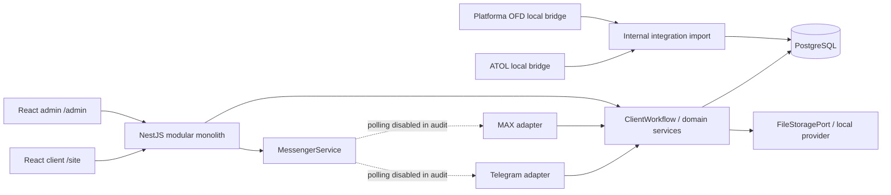

# Повторный аудит VITMA MARKET

Дата: 2026-08-18. Аудитируемая версия: `main` / `be9c7559e9f98cf1c375256c81f39544bf64c2c5`.

## Основания и уверенность

- **Код:** текущее чистое рабочее дерево, NestJS-модули, React-приложения, entities, migrations и tests.
- **Запуск:** отдельная БД `vitma_reassessment_test`, временный FileStorage, fake Telegram token, MAX и polling отключены.
- **Браузер:** production builds на локальном NestJS, только пустая test DB и демонстрационные frontend-данные.
- **Не проверялось:** реальные Telegram/MAX API, production БД/storage, реальные кабинеты АТОЛ/ОФД и production deployment.

## Git

- `HEAD`, локальная `main` и `origin/main` совпадают: `be9c755`.
- Рабочее дерево до аудита было чистым; открытых Pull Request нет.
- В `main` слиты ветки bot audit/B1, admin feedback, integrations unification и прежние feature-ветки.
- Локально не слиты `dev` и `new-requests-system`; они не считаются текущей опубликованной версией.
- После baseline `d27b2ca` добавлены B1-исправления ботов, web-service workflow, payment proof и внешняя синхронизация (86 файлов, +7867/-735).

## Фактическая архитектура

В `AppModule` подключён 21 framework/предметный/инфраструктурный import, включая registrations, tickets, service requests, web sessions, files, audit, admin, assets и integrations (`src/app.module.ts`). Схема управляется пятью migrations; `synchronize` и автоматический migration run отключены.

## Что реально работает

- Регистрация ККТ через web/Telegram/MAX, сохранение в PostgreSQL, PDF и operator workflow. Web-версия не принимает обязательное для bot-flow фото комплекта.
- Тикеты, история сообщений, клиентские и операторские вложения, защищённая выдача файлов и админский чат. Клиентский React этот готовый chat API не показывает.
- Три типа сервисных заявок через общий backend workflow; счёт, payment proof, оплата, визит, инженер, ATOL consent и события доступны по соответствующим каналам.
- Cookie-only admin sessions, multi-role RBAC, управление сотрудниками, Audit Log, customer card, equipment kits и integrations/opportunities.
- Анонимная HttpOnly web-session с server-side ownership.
- FileStorage с random object keys, policy, checksum и coordinated offline backup/restore.
- Shadow-import АТОЛ Connect и Платформы ОФД через локальные read-only bridges; автоматические клиентские действия не выполняются.

Полная матрица и точные ограничения находятся в `FUNCTIONAL_INVENTORY.md`.

## Главные разрывы

1. **Витрина не является магазином.** 24 товара, цены и наличие зашиты в frontend; корзина и «заказ» остаются в `localStorage`. В PostgreSQL нет Product/Order, в админке нет очереди заказов.
2. **Сайт использует малую часть готового backend.** Нет клиентского чата, организаций, оборудования, документов или кабинета. Сервисная web-форма сворачивает богатые поля в две/четыре строки общего flow; status page не получает реальную event history, исполнителя или комментарии.
3. **Каналы расходятся.** Web-регистрация завершается без фото, bot-flow требует фото; website callback кодируется как текст тикета; web attachments для ServiceRequest отсутствуют.

## Состояние client-ui

React/router/API/session foundation пригодны для сохранения. Сайт успешно собрался и не показал horizontal overflow или console errors на 1440x900, 1280x800, 1024x768, 390x844 и 360x800.

Основная проблема не в технической неработоспособности, а в несогласованном продукте и визуальном слое:

- один CSS-файл на 4369 строк содержит последовательные «refresh» и конфликтующие token overrides;
- страница и формы часто слишком высокие, hero почти полностью занимает первый mobile viewport;
- монохромная warm-neutral тема ослабляет узнаваемость зелёного VITMA и статусные акценты;
- реальные товарные/сервисные материалы заменены стилизованными заглушками;
- многочисленные маркетинговые секции и повторные CTA выглядят убедительнее, чем фактическая backend-готовность;
- modal/drawer не имеют полноценного focus management; после validation длинной формы фокус остаётся на нижней кнопке.

## Рекомендация

Рекомендуется **вариант B: новая визуальная оболочка при сохранении data layer**.

Сохранить router, типы, session boundary, API-клиенты после разделения на домены, рабочие registration/service формы и небольшие базовые UI-компоненты. Пересобрать layout, design tokens, page templates, каталог, адаптивную навигацию и CSS-архитектуру. Полный rewrite не оправдан: он повторит уже решённые session/validation/API задачи и повысит риск поломать реальные формы.

До визуальной реализации нужна одна продуктовая развилка: сайт сначала становится **честным каталогом с заявкой менеджеру** или сразу строится **как настоящий order workflow**. Не следует сохранять нынешний checkout-success, пока заказ не существует на сервере.

Рекомендуемое направление: **«Технический центр и поставщик»** — плотный, спокойный B2B-интерфейс, реальные товары и рабочие процессы, зелёный как операционный акцент, графит для структуры, без SaaS-метрик и декоративного card wall. Подробности: `REWORK_STRATEGY.md`.

## Проверки

| Проверка | Результат |
|---|---|
| Config guard / изоляция | passed |
| Lint ratchet | passed; legacy debt 2043 errors / 13 warnings / 112 files |
| Unit/handler/characterization | 18 suites, 71 tests passed |
| Migrations twice / pending / schema drift | passed, 5 migrations |
| Integration | 4 suites, 30 tests passed |
| Offline e2e | 2 suites, 6 tests passed |
| Admin build | 247.45 kB JS, 76.40 kB gzip |
| Client build | 357.92 kB JS, 111.10 kB gzip; один eager bundle |
| Nest production build | passed |
| Offline bootstrap, health, UI/browser smoke | passed |
| Hosted CI текущей `main` | passed, run `32092771955` для `be9c755` |

Реальные messenger API и production resources не использовались.
