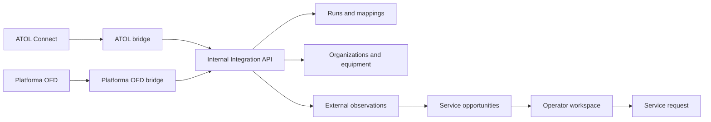

# External data synchronization

## Ownership

VITMA MARKET is the system of record for customer identity, organization
membership, conversations, registrations, service requests, staff decisions,
files, invoices and payments.

ATOL Connect and Platforma OFD are read-only sources. Provider data is applied
through `IntegrationsService`; bridge processes never connect to PostgreSQL.

## Integration records

- `integration_runs`: one logical provider/kind run, including batched imports.
- `integration_errors`: sanitized import failures linked to a run.
- `integration_exclusions`: INN/provider/event scopes that suppress new operator work.
- `external_mappings`: provider identity to local entity identity.
- `organization_contacts`: provider contacts without automatic messenger linking.
- `external_observations`: idempotent provider facts with sanitized metadata.
- `service_opportunities`: a deduplicated operator work item.
- `opportunity_observations`: many provider observations for one opportunity.

An opportunity identity is `type + cash register`, or `type + organization` if
there is no cash register. Repeated observations update the same opportunity.
Resolved observations remain in history but do not create operator work. An
existing opportunity is resolved when its last linked active observation is
resolved, and reopens if the signal becomes active again.
The operator explicitly converts an opportunity into a `ServiceRequest`.
An exclusion never blocks master-data or observation storage. It only prevents
new `ServiceOpportunity` creation for the configured scope.

## Matching

1. Use `ExternalMapping` when it exists.
2. Match an organization by normalized INN and KPP.
3. Match a cash register by RNM, then by organization and factory serial.
4. Match a fiscal drive by its serial and cash register.
5. Never use an address as an automatic identity.

Verified/manual values are not silently overwritten. Provider records populate
missing organization and cash-register fields. Provider-owned FN/OFD records can
be refreshed by the same provider. Missing records are not deleted by a snapshot.

## Runtime boundary

The bridges bind to loopback by default and expose only `GET /health` and
`POST /sync`. Both require `x-vitma-bridge-key`. The NestJS ingestion endpoint
is `POST /internal/integrations/import` and uses the same key. Provider passwords
and browser profiles remain outside NestJS and PostgreSQL.

All imports currently run in `shadow` mode. Shadow mode persists normalized
data and operator opportunities but does not send messages to customers.

## Failure rules

- Provider outage does not affect bots, admin UI or client workflows.
- A changed response schema fails the run without deleting existing data.
- A repeated batch with the same `syncId` and `batchIndex` is ignored.
- Tokens, cookies, URLs and authorization values are removed from metadata.
- Error summaries remove full URLs and are limited in length.
- Detailed import errors contain no credentials or provider URLs.
- Provider archive state marks equipment archived; it does not delete history.

Full fiscal receipts are intentionally not synchronized. VITMA stores equipment
and operational signals; receipt-level data can be fetched on demand in a later
separately reviewed package.
