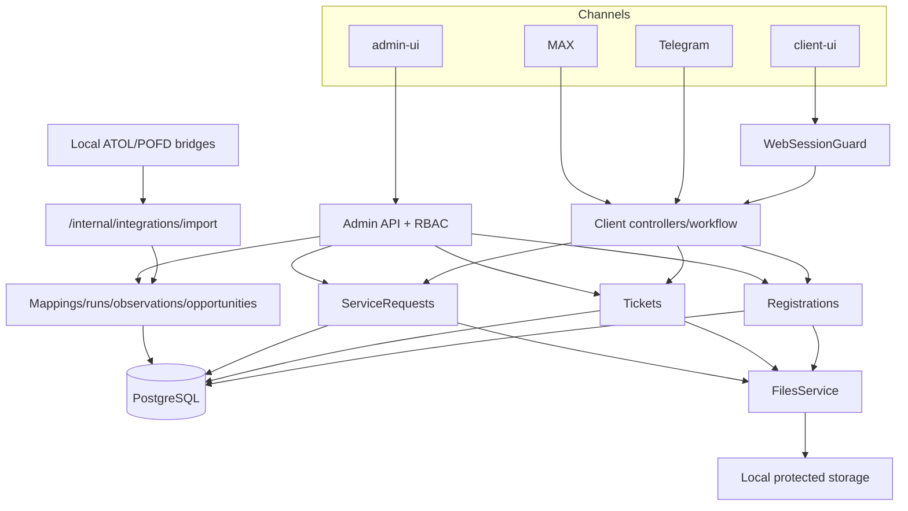

# Интеграции и потоки данных

## Границы владения

**Подтверждено кодом:** VITMA MARKET владеет пользователями/каналами, web sessions, организациями, обращениями, регистрациями, сервисными решениями сотрудников, файлами, оплатой и Audit Log. АТОЛ Connect и Платформа ОФД являются read-only источниками наблюдений. Каталог/заказ магазина пока не имеют server-side владельца.



## Вертикальные сценарии

### Web-регистрация ККТ

```text
CashRegistrationPage
-> registrationService.getFields/submit
-> ClientApiController registration-fields / registrations/form
-> ClientWorkflowService.submitRegistrationForm
-> RegistrationsService
-> registration_requests + StoredFile(PDF)
-> AdminController registrations/PDF
-> admin-ui registrations workspace
```

**Статус:** WORKING по build/integration/browser. **Разрыв:** web не вызывает `submitRegistrationPhoto`; в странице нет file input. Telegram/MAX используют тот же domain service, но требуют photo step. UI обещает проверку комплектности без получения комплекта.

### Вопрос оператору / чат

```text
Telegram/MAX handlers OR public ticket API
-> ClientWorkflowService/TicketsService
-> tickets + ticket_messages + StoredFile
-> AdminController ticket/messages/media/file
-> admin-ui chat
-> MessengerService -> исходный канал
```

**Статус:** CODE_CONFIRMED/WORKING tests. Client React не имеет chat route. Callback dialog вызывает `POST /api/client/tickets/messages`, передавая тему и телефон как одну текстовую строку; это рабочий transport, но не структурированная callback request.

### Web-сервисная заявка

```text
ServiceRequestPage rich form
-> serviceRequestService.create
-> start request
-> sequential answer calls
-> optional confirm-price
-> service_requests.answers JSONB + events
-> admin service workspace
```

**Статус:** WORKING с потерями структуры.

- `fn_replacement`: отправляются INN, concatenated equipment, FN term и phone.
- simple services: отправляются concatenated summary и phone.
- clientType, email, city, address, urgency/help format существуют только внутри строки; в FN path часть полей вообще не попадает в answers.
- UI file list не отправляется; общего attachment API для ServiceRequest нет.
- Start выполняется только при финальном submit, поэтому прежняя проблема пустых drafts от одного нажатия UI не воспроизводится для web.

### Service status

```text
ServiceStatusPage -> GET own service requests -> frontend lookup SR-id
```

**Статус:** PARTIAL. Ownership безопасно основан на web session. Отдельного detail/history endpoint нет; frontend создаёт один timeline event из текущего status и `createdAt`. Перенос номера в другой browser не работает, что честно указано в UI.

### Каталог, корзина, checkout, заказ

```text
data/catalog.ts -> Catalog/Product -> CartContext/localStorage
-> CheckoutPage -> orderService.create -> localStorage
-> inline success UI
```

**Статус:** MOCK/LOCAL_ONLY. Поток обрывается до NestJS. Нет Product, Price, Stock, Cart, Order, OrderItem, status history, admin queue, invoice или protected client status. Server не пересчитывает цену и не знает о заказе.

### Вложения и документы

| Предмет | Сохранение | Выдача | Состояние |
|---|---|---|---|
| Registration photo/PDF | StoredFile; legacy path compatibility | owner/admin protected endpoints | Рабочий bot/admin path; web photo отсутствует |
| Ticket media | StoredFile для hardened paths; legacy metadata remains | owner/admin checks | MAX bounded download fixed; Telegram legacy URL risk deferred |
| Service invoice | StoredFile + legacy id/name | admin + messenger | Работает |
| Payment proof | StoredFile relation | admin protected endpoint | Работает для bot workflow |
| ATOL generated/signed consent | StoredFile | admin/messenger | Работает; temp cleanup tested |
| Service generic attachments | relation/API absent | absent | NOT_IMPLEMENTED |
| Order documents | model absent | absent | NOT_IMPLEMENTED |

### Web-session и identity

`POST /api/client/session` создаёт random `web-{uuid}` user, random token, хранит только hash и выставляет HttpOnly SameSite=Lax cookie на 30 дней. Все sensitive public endpoints получают `chatId/userId` из principal, а не из browser payload. Это подтверждено security integration tests.

Ограничения:

- каждый browser profile становится отдельным User;
- Telegram/MAX/web автоматически не объединяются;
- UI кабинета отсутствует;
- `link-by-inn` немедленно создаёт active owner membership и `confirmedAt`, хотя владение организацией не доказано. Пока route не используется client-ui, но его нельзя выставлять как self-service кабинет без approval flow.

## Админка как интеграционный центр

Admin API агрегирует registrations, tickets, service requests, organizations/assets, staff, audit и external opportunities. Это подходящая основа операционного продукта, но отсутствует Orders context. `admin-ui/src/App.tsx` остаётся монолитным tab component; добавление магазина без decomposition усилит связанность.

## АТОЛ Connect и Платформа ОФД

```text
provider browser/session outside Nest
-> loopback bridge /sync + x-vitma-bridge-key
-> POST /internal/integrations/import
-> IntegrationsService transaction
-> run/error/mapping/master data/observation/opportunity
-> admin review
-> explicit convert to ServiceRequest
```

**Подтверждено тестами:** normalization, idempotent batches, mapping priority, no silent overwrite of verified/manual values, sanitized errors/metadata, exclusion behavior и conversion to ServiceRequest.

**Не проверено в этом аудите:** реальные provider login/session, текущая DOM/API совместимость bridges, объём и полнота клиентских данных. Реальные кабинеты и credentials не использовались.

**Режим:** shadow. Импорт может сохранить нормализованные данные и создать opportunity; сообщения клиенту не отправляются автоматически. Отсутствующие во внешнем snapshot записи не удаляются.

## Параллельные и переходные реализации

- React admin/site являются target UI. Legacy `admin.page.ts` и `site.page.ts` существуют, но включаются только явным development flag; production legacy запрещён.
- `invoiceFileId/path` и `StoredFileId` сосуществуют для compatibility.
- `User.platform/chatId/isAdmin/isOperator/talkingTo` сосуществуют с UserChannel/AdminUser/RBAC; B1 запрещает использовать legacy flags для privileged callbacks.
- ServiceRequest answers JSONB и rich frontend form не имеют общей versioned schema.
- CustomerActivity, ServiceRequestEvent и AuditEvent решают разные задачи и не должны сливаться без domain decision.

## Главные риски потока данных

1. Ложный checkout success без server persistence.
2. Неавторизованное self-link организации по одному ИНН, если существующий API открыть в UI.
3. Потеря структуры rich web service form.
4. Неполный customer-facing status при наличии более богатой server history.
5. Direct messenger delivery без durable outbox/retry/status.
6. Provider bridges зависят от недокументированных внутренних интерфейсов и требуют эксплуатационной сверки.
